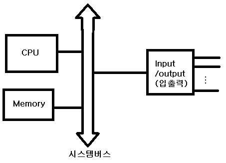
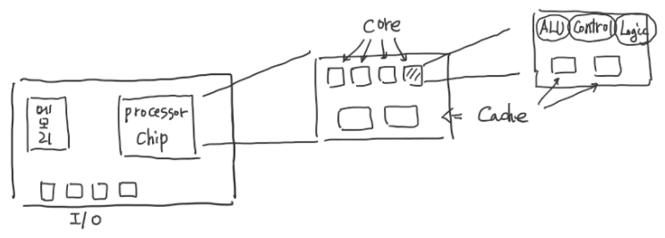
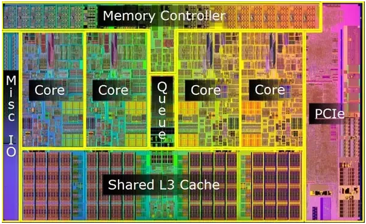
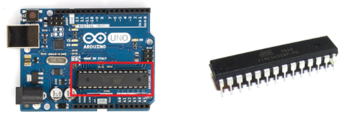

## 컴퓨터 구조

### 컴퓨터 구조

- Computer : 데이터의 처리, 저장, 이동 그리고 일련의 과정을 제어하는 기능을 갖추고 있는 장치를 말함
- 중앙처리장치 CPU  : 데이터 처리
- 메모리 Memory : 데이터 저장
- 입출력장치 I/O : 외부장치(마우스, 키보드, 모니터, 프린터)와 데이터 교환
- 시스템 버스 System Bus : 컴퓨터를 구성하고 있는 시스템 요소 간 데이터 전송 수행

### CPU 내부 구조

- CPU는 위 그림과 같은 구조로 구성되 어있으며 Processor chip이 MPU (Micro Processor Unit) 와 동일한 개념이라고 생각하면 될 것 같다.
- MPU는 아래 그림처럼 구성되어 있고, Core 수에 따라 Single-Core, Multi-Core 등으로 분류가 된다. (코어 수 1, 2, 4... 싱글, 듀얼, 쿼드...)

- 여기서 MCU와 MPU를 헷갈릴 수 있는데, MPU에 Cache만이 아닌 추가적인 Memory와 I/O 제어 기능이 추가되어 One-Chip 으로 구성해 CPU와 같은 기능을 하는 것을 MCU라고 하며, 아두이노의 ATmega가 바로 그러한 Chip 이다.

  Micro Controller Unit만으로 여러 장치들을 제어할 수 있기 때문에 작은 컴퓨터, 마이컴 이라고 부르기도 한다.

  

### 코어 내부 구조

- 산술논리장치 ALU (Arithmetic Logic Unit)

- 제어장치 CU (Control Unit)

- 레지스터 Register

- 캐시 메모리 Cache Memory

- 위와 같이 구성되어 있으며 PC (Program Counter)에 저장된 명령어를 인출 (Fetch) 하여 실행한다. 필요한 데이터는 레지스터에 저장하여 사용하며 데이터가 없는 경우 캐시(L1 - L2 - L3 ..), 주메모리 순으로 데이터를 가져온다.

  Cache에서 데이터를 가져오는 것을 Cache Hit이라고 하고, 데이터가 Cahche에 존재하지 않는 경우를 Cache Miss라고 함

### 출처

>https://velog.io/@ckstn0777/%EC%BB%B4%ED%93%A8%ED%84%B0%EA%B5%AC%EC%A1%B0-%EC%BB%B4%ED%93%A8%ED%84%B0-%EA%B5%AC%EC%A1%B0%EC%99%80-%EA%B8%B0%EB%8A%A5-CPU
>
>https://blog.naver.com/PostView.nhn?isHttpsRedirect=true&blogId=asd7979&logNo=30112164271
>
>https://blog.naver.com/PostView.nhn?isHttpsRedirect=true&blogId=roboholic84&logNo=220815649199
>
>https://blog.naver.com/PostView.naver?blogId=ljh0326s&logNo=220824364345&parentCategoryNo=&categoryNo=7&viewDate=&isShowPopularPosts=false&from=postView