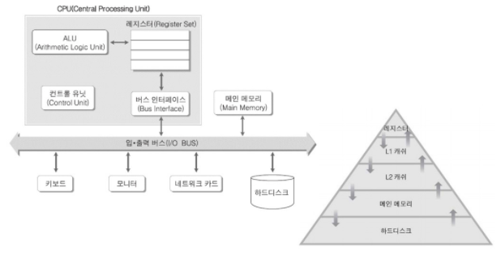
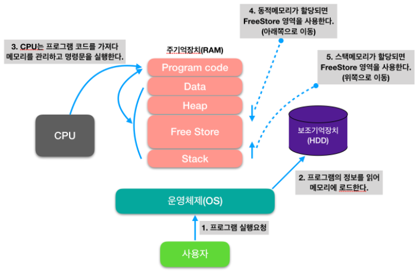

## 메모리 구조

### 메모리 종류

- 레지스터 (Register) : CPU 내 위치한 고속 메모리로 Bit 단위의 데이터를 저장함. FlipFlop으로 구성됨.
- 캐시 (Cache Memory) : CPU Core 바깥에 존재하여 주기억장치와 CPU 간 속도차를 극복하기 위해 사용. SRAM으로 구성됨.
- 주기억장치 (Main Memory) : CPU가 직접 접근하여 데이터를 사용. DRAM으로 구성.
- 보조기억장치 (Hard Disk Driver, Solid State Driver) : CPU가 직접 접근할 수 없고, Device Controller 등을 통해 접근이 가능. HDD는 자기디스크, SSD는 Flash Memory로 구성됨.

### 메모리 계층 구조

- 저장(기억) 단위당 가격 <---> access 성능 간 trade off 존재
- 저장(기억) 용량 <---> 가격 간 trade off 존재
- access 성능 <---> 저장(기억) 용량 간 trade off 존재
- 속도 순 : 레지스터 > 캐시 > 주기억장치 > 보조기억장치
- 용량 지원 순 (단위당 저렴한 가격) 보조기억장치 > 주기억장치 > 캐시 > 레지스터

### 회로 구성

- 레지스터 플립플롭

- SRAM 플립플롭

- DRAM 캐패시터 1T1C

- Flash Memory 1T

### 프로그램 실행 순서

- Program Code가 저장되는 쪽이 낮은 주소, Stack부분이 높은 주소
- 실행 순서

1. 사용자 요청
2. OS에서 프로그램 정보를 읽어 메모리에 로드
3. CPU는 프로그램 코드를 가져와 메모리를 관리하고 읽어들인 명령을 실행
4. 동적(Heap) 메모리는 아래쪽으로, 스택 메모리는 위쪽으로 메모리를 사용함

- 코드 (Code, Text) 영역

  실행할 프로그램의 소스코드가 저장되는 영역

  실행파일을 구성하는 명령어들이 올라가는 메모리 영역으로 함수, 제어문, 상수 등이 여기에 지정됨

- 데이터 (Data) 영역

  전역변수와 Static 변수가 할당되는 영역

  프로그램의 시작과 동시에 할당되고, 프로그램이 종료되어야 소멸되는 영역

- 스택 (Stack) 영역

  프로그램이 자동으로 사용하는 임시 메모리 영역

  함수 호출 시 생성되는 지역변수와 매개변수가 저장되는 영역이고 함수 호출 완료 시 사라진다.

- 힙 (Heap) 영역

  프로그래머가 할당/해제 하는 메모리 공간

  Java에서는 Garbage Collector가 자동으로 해제한다.

  이 공간에 메모리를 할당하는 것을 동적 할당 이라고 부른다.

- 힙과 스택이 서로의 영역을 침범하는 경우 Heap Overflow, Stack Overflow 라고 한다.

### 출처

> https://m.blog.naver.com/ya3344/221245662649
>
> https://jinshine.github.io/2018/05/17/%EC%BB%B4%ED%93%A8%ED%84%B0%20%EA%B8%B0%EC%B4%88/%EB%A9%94%EB%AA%A8%EB%A6%AC%EA%B5%AC%EC%A1%B0/