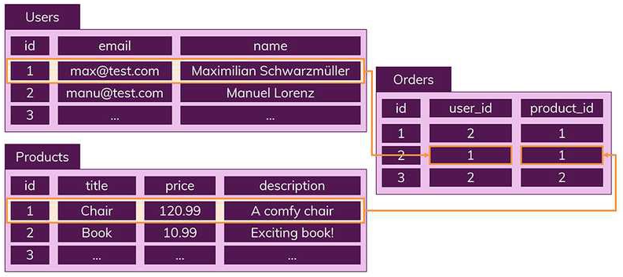
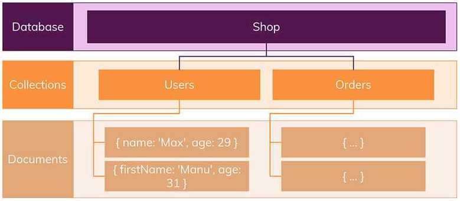
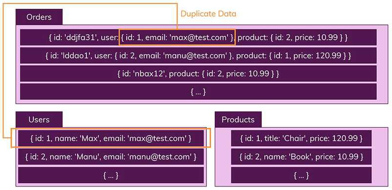

## SQL과 NoSQL의 차이

### SQL (관계형 데이터베이스)

- SQL은 Structured Query Language의 약자로 데이터베이스 자체를 나타내는 것이 아니라 특정 유형의 데이터베이스와 상호작용하는데 사용하는 쿼리 언어이다.

  SQL을 사용하여 RDBMS에서 데이터를 저장, 수정, 삭제, 검색할 수 있다.

  (Create, Read, Update, Delete)

- 특징

  - 엄격한 스키마 (Schema)
    - 데이터는 Table에 Record로 저장되며 명확하게 정의된 구조 (field의 집합) 를 따라야 한다.
    - 구조는 필드 이름과 데이터 유형으로 정의된다.
    - 스키마를 준수하지 않는 데이터는 추가할 수 없다.

  

  - 관계 (Relation)
    - 데이터 중복을 피하기 위해 데이터를 여러개의 테이블로 나누고, 테이블 간 관계를 이용한다.

  

### NoSQL (비관계형 데이터베이스)

- SQL과 반대되는 접근방식을 따르기 때문에 지어진 이름

- Record를 Document라고 부름

- 특징

  - 스키마 없음
    - 다른 구조의 데이터를 같은 Collection (SQL에서의 Table) 에 추가할 수 있다.

  

  - 관계 없음
    - 데이터 간 관계가 존재하지 않기에 Join이라는 개념이 없다.
    - JSON 데이터와 비슷한 형태를 갖고 있다.

  

### 장단점

#### SQL

- 장점
  - 명확하게 정의된 스키마로 데이터의 무결성 보장
  - 데이터 중복에 따른 문제가 적음

- 단점
  - 사전에 스키마를 계획하여야 함
  - 관계에 의한 Join이 많아지고 쿼리가 복잡해질 수 있음
  - 수평적 확장이 어려움 (서버 추가 및 데이터베이스 분산 등)

#### NoSQL

- 장점
  - 스키마가 없어 훨씬 유연함. 데이터에 새로운 필드 추가에 어려움이 없음
  - 데이터가 App이 필요로 하는 형식으로 구성되어 있어 데이터를 읽어들이는 속도가 빠름
  - 수직 (ex 서버 성능 향상) 및 수평 (ex 서버 추가) 확장에 용이
- 단점
  - 데이터 중복에 따른 위험성
  - 데이터가 여러 컬렉션에 중복되어 있으므로 변경점 발생 시 모든 컬렉션에서 수행해야 함

### 결론

- SQL 사용
  - 관계를 맺고 있는 데이터가 자주 변경되는 경우 
  - 명확한 스키마가 중요하며 구조에 변경이 없을 경우
- NoSQL 사용
  - 데이터의 정확한 요구사항을 알 수 없는 경우
  - 데이터베이스의 확장 가능성이 있다고 판단될 때
  - 읽기 (read) 처리가 빈번한 반면, 데이터의 변경 (update) 는 잘 일어나지 않는 경우

### 출처

> https://siyoon210.tistory.com/130