## unstage, commit 되돌리기

### unstage

add하여 stage에 올라간 파일(녹색표시)을 되돌리고 싶으면

- 파일 한개

  git reset HEAD -- [path]/[filename]

- 모든파일

  git reset HEAD -- .

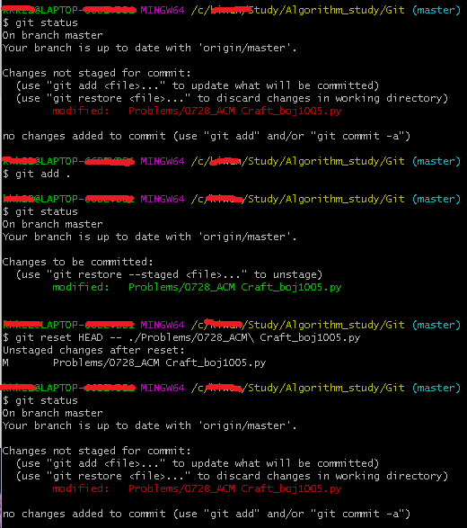

### commit

#### reset

돌아간 커밋 이후의 커밋은 모두 사라진다.

remote repository에 push된 커밋은 reset으로 되돌릴 수 없다.

- working directory의 파일 보존, add이후 staged 상태 (index 보존)

  git reset --soft [commit ID]

- 기본옵션, working directory의 파일 보존, add 이전 unstaged 상태 (index 취소)

  git reset --mixed [commit ID]

- working directory의 파일 삭제, add 이전 unstaged 상태 (모두 취소)

  git reset --hard [commit ID]

  

#### revert

돌아간 커밋 이후의 작업은 사라지나 revert이력이 남는다.

remote repository에 push된 커밋을 되돌리려면 revert를 사용한다.

- git revert [commit ID]

#### reset, revert 예시
- 궁금증이 생겼다. rest 시 [commit ID]에는 돌아가고자 하는 마지막 commit ID를 적어야 하는가, 삭제하려고 하는 commit ID를 적어야 하는가..?

- 일단 맨 위 커밋을 reset하고자 시도했는데, 헤드는 맨위 커밋에 그대로 있다.
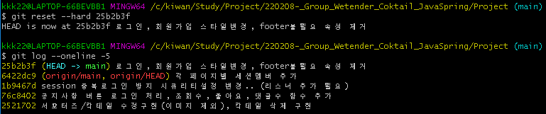

- soft, mixed 또한 삭제하려는 commit ID로는 생각대로 동작하지 않는다.
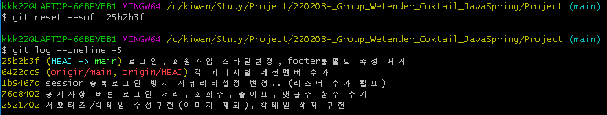
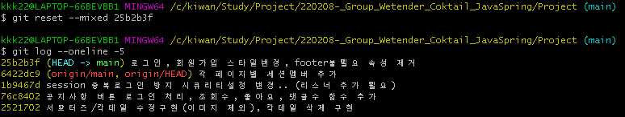

- revert는 revert 이력이 추가된다. working directory는 변화가 없음.
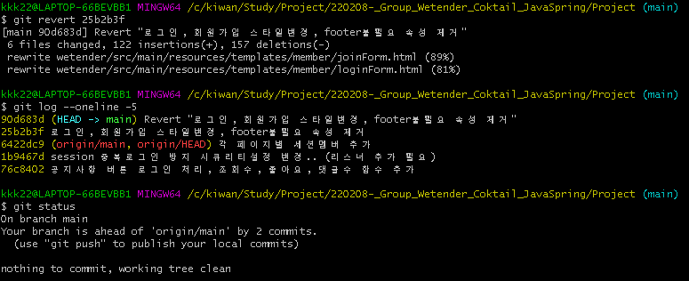

- 그래서 HEAD~2로 위 두개 커밋을 날려보았다. 변경한 코드 자체가 사라져버렸다.
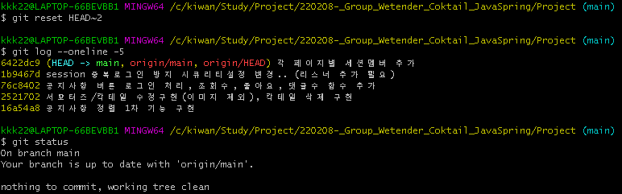

- git reflog 를 참조하여 HEAD@{7}로 강제 이동시켰다.
- 커밋은 되어있으나 intelliJ에 코드는 날아가 있는 상태 그대로..
- 지금 다시 생각해보니 여기 staged된 것이 원복된 변경부분 인듯 싶다.
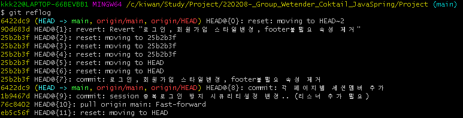
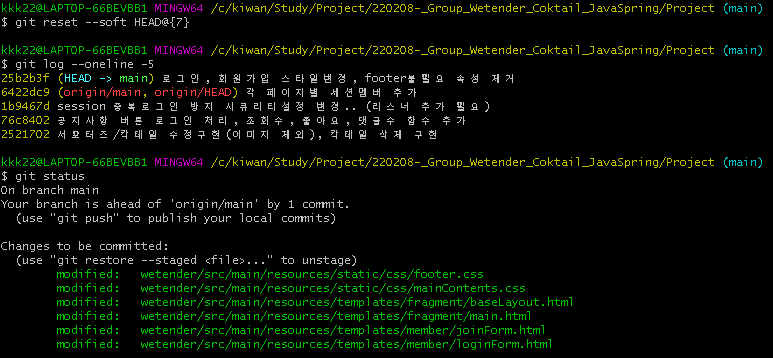

- 다시 revert했던 곳으로 강제 이동시켜
- restore로 조심스럽게 빨간색 변경부분을 삭제했더니 intelliJ에서도 코드가 원복되는 것을 확인할 수 있었다
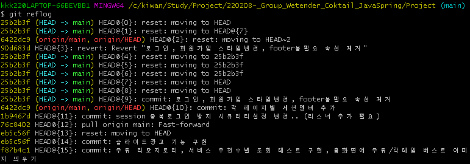
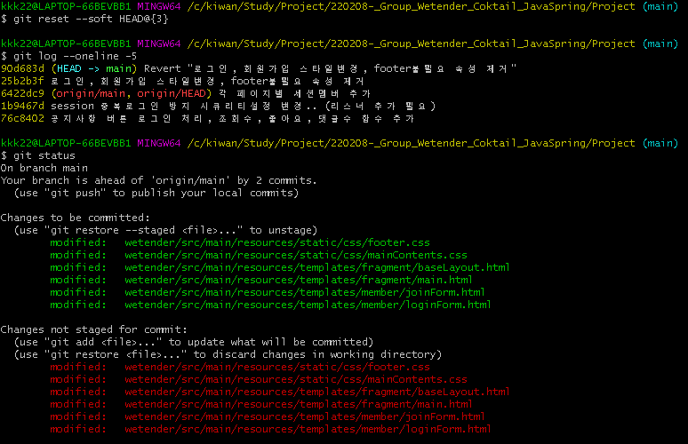
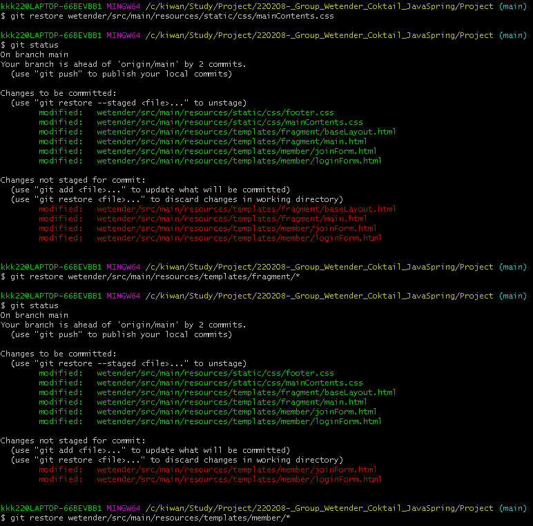