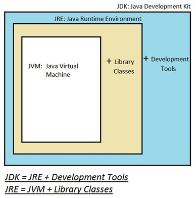
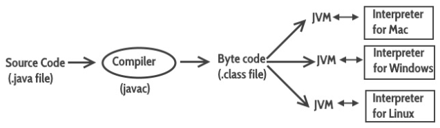

## JDK, JRE, JVM

### 출처

>https://wikidocs.net/257
>
>https://m.blog.naver.com/duqrlwjddns1/221770110714
>
>https://www.itworld.co.kr/news/110768
>
>https://codevang.tistory.com/86

### 한줄 요약

#### JDK (Java Development Kit)

> 자바 개발 도구의 약자로 자바 언어로 만들어진 소스코드를 컴파일하고 자바 애플리케이션을 개발할 수 있도록 해주는 개발 환경의 세트를 의미

#### JRE (Java Runtime Environment)

> 자바 실행 환경의 약자로 컴퓨터 운영체제 위에서 실행되면서 자바를 위한 부가적인 서비스를 제공하는 소프트웨어 계층
>
> 자바 프로그램을 위한 운영체제라고 생각하면 된다

#### JVM (Java Virtual Machine)

> 자바 가상 머신의 약자로 자바 프로그램 실행을 담당하는 실행 소프트웨어.
>
> 자바 프로그램이 기기 (device), 운영체제 (OS) 에 상관없이 실행될 수 있게 해 준다. (WORA)

### Java의 원칙 - WORA

- 한번 쓰고 모든 곳에서 실행한다. (WORA, Write Once, Run Anywhere)

### JDK (Java Development Kit)

- 자바 개발 도구의 약자로 자바 언어로 만들어진 소스코드를 컴파일하고 자바 애플리케이션을 개발할 수 있도록 해주는 개발 환경의 세트를 의미

- JRE와 개발을 위해 필요한 도구 (javac, java 등의 java compiler) 을 포함한다.

  

- .java 파일 (Source Code) 는 컴파일을 거쳐 .class 파일이 된다.

- .class 파일 (Byte code) 는 JVM에 의해 실행된다.

  

- JDK를 설치하면 JRE, JVM이 자동으로 설치된다.

- Java 개발을 하지 않는 일반 사용자들은 Java 프로그램을 실행만 하면 되므로 JRE만 설치해도 된다.

### JRE (Java Runtime Environment)

- 자바 실행 환경의 약자로 컴퓨터 운영체제 위에서 실행되면서 자바를 위한 부가적인 서비스를 제공하는 소프트웨어 계층

  과거 대부분의 소프트웨어가 운영체제를 런타임 환경으로 사용하면서 리소스 액세스를 운영체제 설정에 의존하였으나 자바용 런타임 환경이 등장하면서 이러한 틀을 완전히 바꿔놓았다.

  JRE는 자바 프로그램을 위한 일종의 메타 운영체제로, 자바 애플리케이션 실행을 위해 파일을 로드하고 메모리 및 기타 시스템 리소스에 대한 액세스를 확보하는 플랫폼이라고 생각하면 된다.

- JRE는 JVM이 자바 프로그램을 동작시킬 때 필요한 라이브러리 파일들과 기타 파일들을 가지고 있다.

  자바 클래스 라이브러리 (Java class libraries), 자바 가상 머신 (JVM), 자바 클래스 로더 (Java class loader)를 포함하고 있음

  자바 코드(컴파일된 코드)를 라이브러리와 결합한 후 JVM을 통해 실행시킴 (Linking + Loading)

- JRE는 JVM의 실행환경을 구현했다고 할 수 있으며 JVM이 원활히 작동할 수 있도록 환경을 맞춰주는 역할을 한다.

### JVM (Java Virtual Machine)

- 자바 가상 머신의 약자로 자바 프로그램 실행을 담당하는 실행 소프트웨어이다.

- 자바 프로그램이 기기 (device), 운영체제 (OS) 에 상관없이 실행될 수 있게 해 준다. (WORA)

  JVM은 플랫폼에 의존적임. 즉 리눅스의 JVM과 윈도우의 JVM은 다르나, 컴파일된 바이너리 코드는 어떤 JVM에서도 동작시킬 수 있다.

- 자바 프로그램의 메모리를 효율적으로 관리 & 최적화해 준다

  - 가비지 컬렉션 (Garbage Collection)

    - JVM이 메모리를 관리하는 프로세스를 지칭

    - 자바 프로그램 상에서 사용하지 않는 메모리를 지속적으로 찾아 제거함으로써 효율적인 메모리 관리를 가능하게 함

- 자바 소스코드로부터 만들어지는 자바 바이너리 파일(.class)을 실행할 수 있다. 

  - 읽기 / 검증 / 실행
  - 실행환경의 규격 제공 (실행에 필요한 라이브러리 및 기타 파일)

### 자바 메모리 구성

- 자바 메모리는 힙, 스택, 메타 스페이스로 구성
  - 힙 : 자바 변수 내용을 저장하는 장소
  - 스택 : 함수 실행 및 변수 참조를 저장하는 장소
  - 메타 스페이스 (펌젠) : 클래스 정의와 같이 프로그램에서 변화하지 않는 정보를 저장하는 장소
- 자바 8 이후 프로그램 메타 수요에 따라 자동으로 메타 스페이스의 크기를 조절해줌

