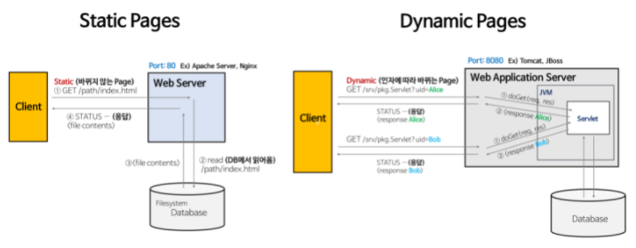
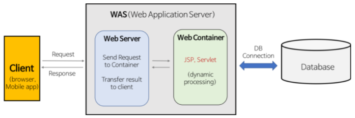
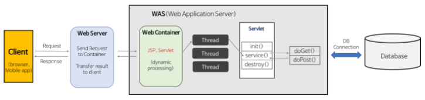

## Web Server, Web Application Server

### Static Page, Dynamic Page

- Static Page
  - Web Server는 파일 경로 이름을 받아 경로와 일치하는 file contents를 반환
  - 항상 동일한 페이지를 반환 (image, html, css, javscript 파일과 같이 저장소에 저장되어 있는 파일들)
- Dynamic Page
  - 인자의 내용에 맞게 동적인 contents를 반환
  - 웹 서버에 의해 실행되는 프로그램(Servlet, WAS 위에서 돌아가는 Java Program)을 통해 만들어진 결과물
  - Servlet에 doGet() 메소드를 구현해야함

### Web Server, WAS 차이점

- Web Server
  - 개념
    - (하드웨어) Web Server가 설치되어 있는 컴퓨터
    - (소프트웨어) 웹 브라우저 (클라이언트) 로부터 HTTP 요청을 받아서 정적인 컨텐츠 (.html, .jpeg, .css 등) 을 제공하는 컴퓨터 프로그램
  - 기능
    - HTTP 프로토콜 기반 클라이언트의 요청을 서비스하는 기능을 담당
    - WAS를 거치지 않고 자원 (정적 컨텐츠) 제공
    - 동적인 컨텐츠 제공을 위한 요청 전달. 클라이언트의 요청 (Request) 을 WAS에 보내고 그 결과를 클라이언트에 전달 (응답, Response)
  - 종류
    - Apach Server, Nginx, IIS (Windows 전용 Web 서버) 등
- WAS (Web Application Server)
  - 개념
    - DB 조회나 다양한 로직 처리를 요구하는 동적인 컨텐츠를 제공하기 위해 만들어진 Application Server
    - HTTP를 통해 컴퓨터나 장치에서 App을 수행하는 미들웨어 (소프트웨어 엔진) 이다.
    - Web Container 혹은 Servlet Container 라고도 불린다.
      - Container란 JSP, Servlet을 실행시킬 수 있는 소프트웨어. (JSP, Servlet 구동 환경 제공)
  - 기능
    - 프로그램 실행 환경과 DB 접속 기능 제공
    - 트랜잭션 (논리적 작업 단위) 관리 기능
    - 업무를 처리하는 비즈니스 로직 수행
  - 종류
    - Tomcat, JBoss, Jeus, Web Sphere 등

### Web Server와 WAS 분리하는 이유

- 웹 페이지는 정적 컨텐츠, 동적 컨텐츠가 모두 존재함

  모든 동적 컨텐츠를 만들어놓은 후 제공하기에는 자원이 절대적으로 부족함

  클라이언트의 요청 발생 시 WAS에서 비즈니스 로직에 맞는 결과를 만들어 제공함으로써 자원의 효율적 사용이 가능

- 서버 부하 방지

  동적 컨텐츠는 요청이 있을 때 마다 WAS에서  처리

  정척 컨텐츠까지 WAS에서 처리하도록 한다면 데이터 처리로 인한 부하가 커져 동적 컨텐츠의 처리가 지연됨. 페이지 노출 시간이 늘어남

- 물리적으로 분리하여 보안 강화

- 여러대의 WAS 연결이 가능하므로 장애 (Fail) 극복 및 처리에 있어 높은 신뢰성을 가질 수 있음

  무중단 운영을 가능하게 함으로써 오류가 발생한 WAS가 존재하여도 사용자는 오류를 느끼지 못함

- 여러 Web Applicaiton 서비스 가능

  하나의 서버에서 PHP App, Java App을 함께 사용할 수 있음

- 접근 허용 IP관리, 세션 관리 등 Web Server에서 처리하면 효율적임

- Web Server를 WAS 앞에 두는 구조로 서버를 구성하면 자원 이용의 효율성 및 장애 극복, 배포 및 유지보수의 편의성이 높아짐. 분산 처리에 효과적.

### Web Service Architecture

- 다양한 구조를 가질 수 있음
  1. Client -> Web Server -> DB
  2. Client -> WAS -> DB
  3. Client -> Web Server -> WAS -> DB

- Client -> Web Server -> WAS -> DB 동작 과정

  1. 클라이언트 -> Web Server HTTP 요청

  2. 클라이언트 요청 (Request) 을 WAS로 보냄
  3. WAS는 관련 Servlet을 메모리에 올림
  4. WAS는 web.xml을 참조하여 Servlet에 대한 Thread 생성 (Thread Pool 이용)
  5. HttpServletRequest와 HttpServletResponse 객체 생성하여 Servlet에 전달
     - Thread는 Servlet의 service() 호출
     - service() 메소드는 요청에 맞게 doGet() 또는 doPost() 메소드 호출
  6. doGet(), doPost() 메소드는 인자에 맞게 생성된 적절한 동적 페이지를 Response 객체에 담아 WAS에 전달
  7. WAS는 Response 객체를 HttpResponse 형태로 바꾸어 Web Server에 전달
  8. 생성된 Thread 종료, HttpServletRequest, HttpServletResponse 객체 제거

### DBMS, Middleware 개념

- DBMS
  - 다수의 사용자들이 DB 내 데이터 접근할 수 있도록 도와주는 소프트웨어
  - Server의 형태로 서비스 제공
  - MySQL, MariaDB, Oracle, PostgreSQL 등이 있음
  - DBMS Server에 직접 접속해서 동작하는 Client 프로그램 문제점
    - 로직이 많아지며 프로그램 크기가 커짐
    - 로직이 변경될 때마다 매번 새로 배포하여야 함
    - Client에 대부분의 로직이 포함되므로 보안에 취약
    - Middleware를 Client와 DBMS 사이에 두어 해결
- Middleware
  - Client와 DBMS 사이에서 비즈니스 로직을 수행하는 Server로 Middleware를 사용함으로써 Client는 입력과 출력만 담당하게 됨
  - Client - Middleware Server - DB Server (DBMS)
  - Client는 단순히 Middleware Server로 요청만 보냄
  - Middleware Server에서 대부분의 로직이 수행됨. (DB 연동한 작업 포함)
  - 결과를 Client에 전달하고 Client에서는 화면을 출력

### 출처

> https://gmlwjd9405.github.io/2018/10/27/webserver-vs-was.html

