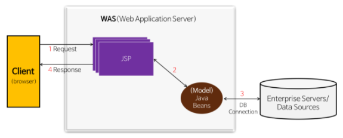
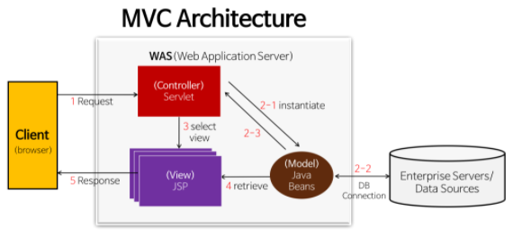

## JSP, Servlet

### Servlet

- 웹 기반 요청에 대해 동적 처리가 가능한 Server side에서 돌아가는 Java Program
- Java 코드 안에 HTML 코드
- 웹 개발을 위한 표준임

### JSP

- Java 언어 기반 Server side 스크립트 언어
- HTML 코드 안에 Java 코드가 있다.
- Servlet을 보완하고 기술 확장한 스크립트 방식의 표준
  - All Servlet 기술 + implicit object / predefined tags / expression language / custom tags

### JSP, Servlet 차이점

#### 기능의 차이는 없고 역할의 차이만 있다.

#### Servlet

- Java 코드 안에 HTML 코드

- data processing (controller) 에 좋다

  즉, DB와의 통신, Business Logic 호출, 데이터 읽기 등의 작업에 유용

- Servlet이 수정된 경우 Java 코드를 컴파일 (.class 파일 생성) 후 동적 페이지를 처리하기 때문에 전체 코드를 업데이트하고 재 컴파일 한 후 재배포 하는 작업 필요 (개발 생산성 저하)

#### JSP

- HTML 코드 안에 Java 코드

- Presentation (View) 에 좋다

  즉, 요청 결과를 나타내는 HTML 작성에 유용

- JSP가 수정된 경우 재배포할 필요 없이 WAS가 알아서 처리 (쉬운 배보)

#### JSP만 사용하는 모델

- JSP가 사용자의 요청을 받아 Java Bean (DTO, DAT) 호출하여 적절한 동적 페이지 생성

- JSP로 작성된 프로그램은 내부적으로 WAS가 Servlet 파일로 변환

  JSP 태그 분해, 추출하여 순수한 HTML 웹 페이지로 변환

  클라이언트로 응답 전송

- Presentation Logic (View) 와 Business Logic (Controller)가 혼재해 있다.

  코드가 복잡해져 유지보수가 어려움

#### JSP와 Servlet 모두 사용하는 모델 (MVC Architecture)

- JSP와 Servlet을 모두 사용하여 Presentation Logic과 Business Logic을 분리함
- View는 HTML 중심이 되는 JSP 사용
- Controller는 Java 코드가 중심이 되는 Servlet을 사용
- Model은 Java Beans로 DTO, DAO를 통해 DB에 접근

### 참고

> https://gmlwjd9405.github.io/2018/11/04/servlet-vs-jsp.html