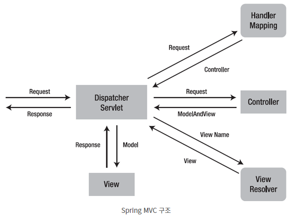
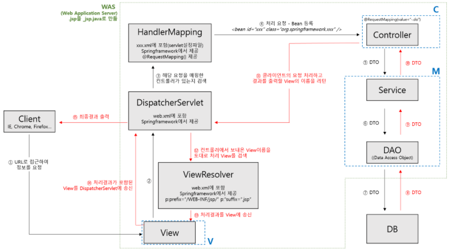
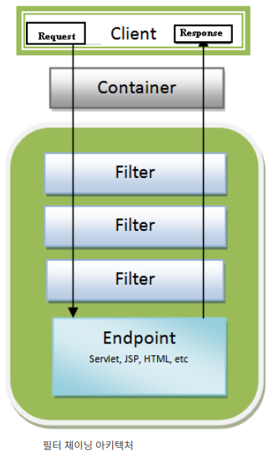
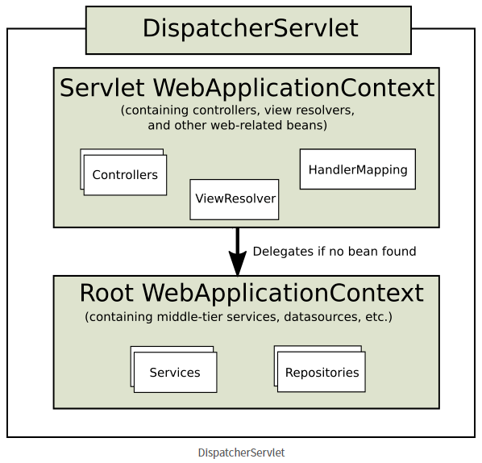
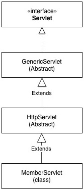
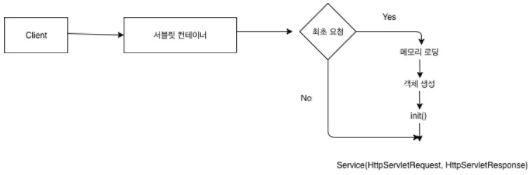
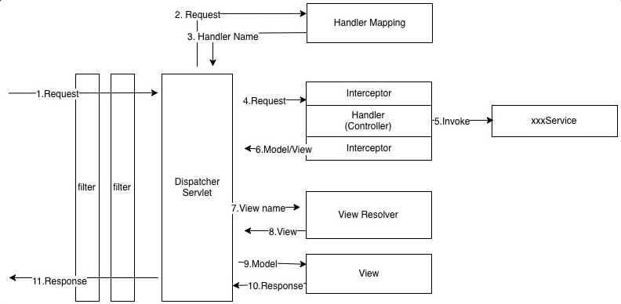

## Spring MVC

### 자바 웹 기술의 역사

- 서블릿

  고대의 서블릿은 자바 코드로 html을 만들기 어려웠다. JSP가 등장한다..

- JSP

  html은 편리하긴 하나 비즈니스 로직이 너무 많아져 한 파일의 내용이 길어지게 됨..

- 서블릿 + JSP 조합의 mvc 패턴

  관심사를 나누어서 개발

- mvc 프레임워크

  2000 ~ 2010년 초. 스트럿츠, 앱워크 등등 mvc 패턴 자동화를 편리하게 해주는 웹 기술이 다양하게 등장

- annotation 기반 스프링 mvc

  @Controller

  스프링 + 다른 mvc 프레임워크 의 구조로 사용해왔는데, annotation으로 깔끔하게 mvc를 구현할 수 있게 됨

- 스프링 부트

  개발자들이 불편해 했던 것들을 다 자동화 해줌

  스프링 부트는 서버를 내장

  과거 was (톰캣 등) 을 서버에 설치하여 실행하고, 소스코드는 따로 빌드한 후 jar 파일들 -> war로 만들어 배포하는 복잡한 과정을 거쳤음

  스프링 부트가 톰캣 서버를 내장하면서 jar를 실행하면 모든 것이 한 번에 실행 됨.

### Spring MVC의 구조

#### 동작 순서

#### 동작 순서 상세

1. Request

2. DispatcherServlet

   클라이언트의 요청을 DispatcherServlet이 (web.xml에 등록된 요청이면) 가로챔

3. HandlerMapping

   DispatcherServlet이 요청을 HandlerMapping으로 보내 처리할 수 있는 Controller를 찾음

4. Controller (-> Service -> DAO -> DB -> DAO -> Service -> Controller)

   Serivce를 동작하여 실제 로직 처리하여 결과 반환

   반환한 결과와 servlet-context.xml에 설정된 prefix와 suffix 정보를 참조하여 결과에 해당하는 파일을 찾는데 필요한 정보를 제공

5. DispatcherServlet

6. ViewResolver

   로직 처리 후 ViewResolver를 통해 view 화면을 찾음

7. View

   찾은 화면은 View와 DispatcherServlet을 거쳐 클라이언트로 응답됨

8. DispatcherServlet

9. Response

### 서블릿 (Servlet)

서블릿을 상세하게 설정할 수 있기 때문에 무엇이 있는지 확인하고 가는 것도 좋을 듯 하여 기록해 놓는다. 참고 블로그를 통해 상세 내용 (코드까지) 를 확인할 수 있다.

#### 서블릿이란

- 자바를 사용하여 웹 페이지를 동적으로 생성하는 서버측 프로그램 혹은 그 사양을 말함
- 서블릿 애플리케이션을 만들고 web.xml에 등록하여 원하는 url과 매핑하는 방식으로 사용

#### 서블릿 리스너 (Servlet Listener)

- 웹 애플리케이션에서 발생하는 주요 이벤트를 감지하고 각 이벤트에 특별한 작업이 필요한 경우에 사용
- ServletListener 클래스를 생성하여 web.xml에 Listener로 등록하여 사용

#### 서블릿 필터 (Servlet Filter)

- 서블릿으로 들어오는 요청이나 나가는 응답 전후에 특별한 처리를 하기 위해서 사용하는 것으로 서블릿 컨테이너에 등록해서 사용

- 체이닝 하여 여러개의 필터를 거쳐 요청을 처리할 수 있다. (ex Spring Security)

- filter 클래스를 만들고 web.xml에 filter 등록을 하고 원하는 서블릿에 mapping 하여 사용

  

#### 서블릿에서 스프링 빈 사용

- ContextLoaderListener 를 Servlet Listener로 등록하고, context-param 으로 사용할 Application Context 와 Application Context 가 빈으로 등록할 config, service를 만든다.

- ContextLoaderListener 는 IOC 컨테이너인 Application Context 를 만들어준다. (IOC 컨테이너는 ServletContext를 통해 사용 가능)

  Application Context 를 Servlet Context 생명주기에 맞춰 등록하고 삭제해준다.

  Application Context 는 @Configuration, @Component 가 붙은 클래스를 IOC 컨테이너에 빈으로 등록한다.

  

#### 스프링 MVC와 서블릿 연동

- 서블릿을 하나씩 연결할 수 있으나 번거롭고 복잡하므로 Front Controller 를 생성하여 각각의 Application Controller 에 작업을 위임하는 방식의 패턴을 사용하게 됨

  

- Front Controller의 역할을 스프링 프레임워크에서 DispatcherServlet이라는 서블릿이 하게 됨. 보통 DispatcherServlet은 하나만 존재함 (싱글톤 객체)

- DispatcherServlet은 Servlet WebApplicationContext 를 만들고 이는 Root WebApplicationContext 를 부모로 가지고 있음

  

### 스프링 부트 동작 과정

반복되는 내용이 있을 수 있지만 여기까지 읽으면 서블릿과 실행, 스프링 부트에서 서블릿의 실행 과정까지 전체적으로 이해하기 위해 중복 내용을 상기하면서 끝까지 읽어보십시오...

#### 서블릿 컨테이너

- 웹 애플리케이션 서버중 HTTP 요청을 받아 처리하는 기초 역할을 함

- 대부분의 웹 프레임워크가 제공하는 기능은 서블릿 컨테이너 위에서 동작하는 서블릿, 필터, 이벤트 리스너 등을 적절하게 구현한 것으로,

  사용자가 웹 프레임워크로 작성한 웹 애플리케이션은 결국 서블릿 컨테이너 위에서 동작

- 종류로는 아파치 톰켓, 제티 등이 서블릿 컨테이너로 널리 사용되고 있음

#### 사용자 서블릿

- 톰켓, 즉 서블릿 컨테이너에 의해 프로그램이 실행되기 위해 표준 Servlet Interface를 구현해야함.

- 사용자 정의 서블릿은 서블릿 컨테이너 내 등록된 후 서블릿 컨테이너에 의해 생성, 호출, 소멸이 이루어짐.

  서블릿은 자신의 상태 변경 시점을 알아내 적절한 리소스 획득/반환 처리를 해야하므로 Servlet Interface 에 init/destroy 메소드가 정의됨.

  다시 말해 서블릿 컨테이너가 서블릿 생명주기에 따라 서블릿의 상태를 변경하면서 서블릿 인터페이스에 정의된 메소드를 실행한다.

- Servlet <--- GenericServlet <--- HttpServlet 순으로 상속하여 구현

  Servlet : 서블릿 프로그램 개발 시 반드시 구현해야 하는 메소드 선언하고 있는 인터페이스. 상속해야 서블릿 컨테이너가 실행 가능한 서블릿이 된다.

  GenericServlet : 클라이언트 - 서버 환경에서 서버단의 애플리케이션으로 필요한 기능을 구현한 추상 클래스. service() 메소드 제외한 모든 메소드 재정의하여 적절히 구현하였음. GenericServlet을 상속하면 애플리케이션의 프로토콜에 따라 메소드 재정의 해야함.

  HttpServlet : GenericServlet의 유일한 추상 메소드인 service를 HTTP 프로토콜 요청 메소드에 적합하게 재구현 해놓음. GET/POST/PUT/DELETE/HEAD/OPTIONS/TRAC 을 처리하는 메소드가 모두 정의되어 있음.

  

- 개발자가 정의한 MemberServlet의 service를 서블릿 컨테이너가 실행할 것임. 만약 service가 아닌 method 방식으로 처리하고 싶다면 HTTP Method 방식을 구현하면 됨.

#### 서블릿 실행 순서

- 서블릿 컨테이너가 서블릿의 실행을 관리함. 즉 서블릿 컨테이너에 의해 사용자가 정의한 서블릿 객체가 생성되고 호출되고 사라짐.

  이렇게 개발자가 아닌 프로그램에 의해 객체들이 관리되는 것을 IOC (Inversion of Control) 이라고 함.

  

- 클라이언트로부터 요청이 들어오면 현재 실행할 서블릿이 최초의 요청인지 판단하고, 서블릿이 메모리에 없으면 해당 서블릿을 새로 생성함. 최초 1회만 일어나는 작업

  init() : 서블릿이 최초 생성되고 바로 호출되는 메소드

  service() : 요청이 들어올 때마다 호출되는 메소드

  destroy() : 서블릿 컨테이너가 종료될 때 호출되는 HttpServlet의 메소드

#### MVC 패턴

- HTTPServlet을 상속받고 HTTP Method에 맞게 서블릿을 구현한 클래스들을 요청이 들어오는 URL 마다 매핑해서 사용한다면 유지 보수, 확장성 등이 점점 더 어려워지게 된다.

  다양한 요청의 매핑을 편리하게 해주는 것이 Model (비즈니스 로직), View (화면), Controller (request 처리) 로 나누어 개발을 하는 MVC 패턴이다.

- FrontController 가 맨 앞 단에서 각 컨트롤러에 요청(URL)에 맞는 매핑을 해준다.

- 스프링 부트에서 사용자 정의 프로그램을 구현한 프로그램인 서블릿은 DispatcherServlet이다. FrontController 역할을 한다.

  톰캣(Servlet Container = DispathcerServlet)를 내장하고 있는 스프링 부트가 실행되며 내장 톰캣을 실행한다.

  

- 실행 순서

  - DispatcherServlet 이 스프링 빈으로 등록됨

  - Servlet Container (DispatcherServlet) Context에 Servlet 등록

  - Servlet Container Context에 Filter 등록

  - Servlet Container에 각종 Handler매핑. (컨트롤러 빈들이 생성되어 싱글톤으로 관리됨)

    

  - 클라이언트 요청

  - FrameworkServlet.service() -> dispatch.doService() -> dispatch.doDispatch() 순 호출

  - doDispatch() 는 AbstractHandlerMapping 에서 Handler (Controller) 를 가져옴

  - Handler 는 ModelView 를 리턴

  - View 정보를 View Resolver에서 객체로 얻음

  - View 객체를 View 에서 렌더링

    

### 참고

> https://velog.io/@junho918/%EC%8A%A4%ED%94%84%EB%A7%81-MVC-%EA%B7%B8%EB%9E%98%EC%84%9C-%EC%9B%B9-%EC%84%9C%EB%B2%84%EA%B0%80-%EB%8C%80%EC%B2%B4-%EB%AD%94%EB%8D%B0
>
> https://doflamingo.tistory.com/17
>
> https://devpad.tistory.com/24
>
> https://doflamingo.tistory.com/45
>
> https://wrkbr.tistory.com/520
>
> https://velog.io/@koseungbin/Web-Server-Web-Application-Server