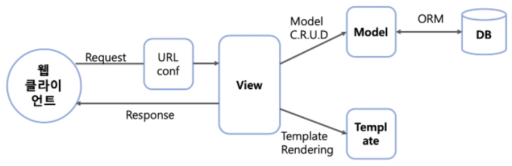

## MTV

### MVC와 차이

| 자바 스프링 | 파이썬 장고 | 역할               |
| ----------- | ----------- | ------------------ |
| Model       | Model       | 데이터             |
| View        | Template    | 화면               |
| Controller  | View        | 데이터와 화면 연결 |

### MTV 구조

- Python Django 프레임워크에서 사용하는 디자인 패턴으로 Django의 MVC 패턴이라고 생각하면 된다.
- Model -> Model
  - 데이터베이스와 데이터를 주고받는 부분
- View -> Template
  - model 의 데이터를 가지고 사용자에게 보여줄 화면을 구성하는 부분
- Controller -> View
  - 클라이언트로부터 들어온 요청에 대한 응답으로 비즈니스 로직을 구현하여, model 과 데이터를 주고받은 결과를 template 으로 넘겨준다.

#### MTV 동작 과정

- 클라이언트로 요청을 받으면 URLconf 를 이용하여 URL을 분석한다.
- 분석 결과를 가지고 처리를 담당할 View 를 결정한다.
- View 는 비즈니스 로직을 실행한다. 데이터베이스 처리가 필요하면 해당 Model 에 요청하고 결과를 받는다.
- View 는 로직 처리가 끝나면 Template 에 결과를 넘겨주고 클라이언트에 전달할 화면 (HTML) 구성을 한다.
- View 에서 최종 결과를 클라이언트에 보내 응답을 마친다.

### MTV 구성요소

#### Model

- 사용될 데이터에 대한 정의를 담고 있는 Django의 클래스
- ORM이나 SQL을 사용하여 데이터베이스에 데이터를 가져오거나 저장
- models.py 에서 모델 클래스를 정의

#### ORM

- 객체와 관계형 데이터베이스를 연결해주는 역할
- SQL을 사용하지 않고 데이터베이스 Schema 를 구성하고 접근
- 객체를 사용해 데이터를 처리하며 데이터를 요청하면 객체 형태로 데이터를 반환한다.

#### URLconf

- 클라이언트로부터 받은 요청을 가장 먼저 처리하는 부분
- 요청에 들어있는 URL이 urls.py 파일에 정의된 URL 패턴과 일치하는지 분석하고, 일치하는 URL 패턴의 View 를 호출
- 동작 순서
  - settings.py 파일의 ROOT_URLCONF 항목을 읽어 최상위 URLconf 의 위치를 확인
  - URLconf 를 로딩하여 urlpatterns 변수에 지정되어 있는 URL 리스트를 검사하여 요청과 일치하는 URL 패턴을 찾음
  - URL 의 view (함수 또는 클래스 메소드) 를 호출.
  - 호출 시 HttpRequest 객체와 URL 패턴을 찾을때 추출한 단어들을 view 의 인자로 넘겨줌
  - 요청과 일치하는 URL 패턴을 찾지 못하면 에러를 처리하는 view를 호출

#### Path Converter

- urlpatterns 변수에서 / 부분을 가리킴
- URL 패턴의 일부 문자열을 추출하기 위한 것

#### View

- 클라이언트로부터 요청을 받고 응답을 반환
- 응답 메세지는 HTML, JSON, XML, Redirection, 에러 등
- views.py 에서 함수 또는 클래스의 메소드로 정의

#### Template

- 클라이언트에게 반환되는 HTML 을 작성
- Django 에서 Template 파일을 찾을 때는 settings.py 의 TEMPLATES 및 INSTALLED_APPS 에서 지정된 앱의 디렉토리에서 *.html 파일을 찾으면 됨
- *.html Django의 template 시스템 문법에 맞게 작성한다.

### 출처

>https://velog.io/@inyong_pang/Programming-MVCMTV-%EB%94%94%EC%9E%90%EC%9D%B8%ED%8C%A8%ED%84%B4
>
>https://velog.io/@inyong_pang/Django-MVTModel-View-Template-%ED%8C%A8%ED%84%B4
