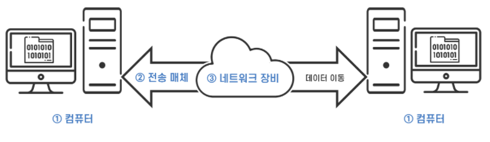
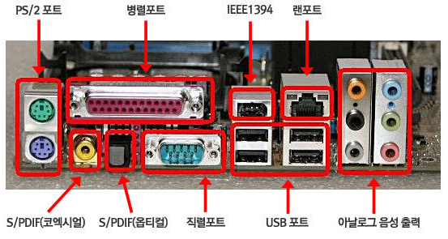
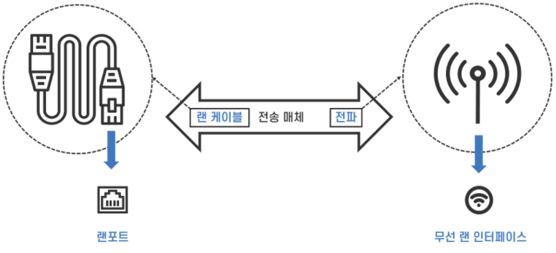
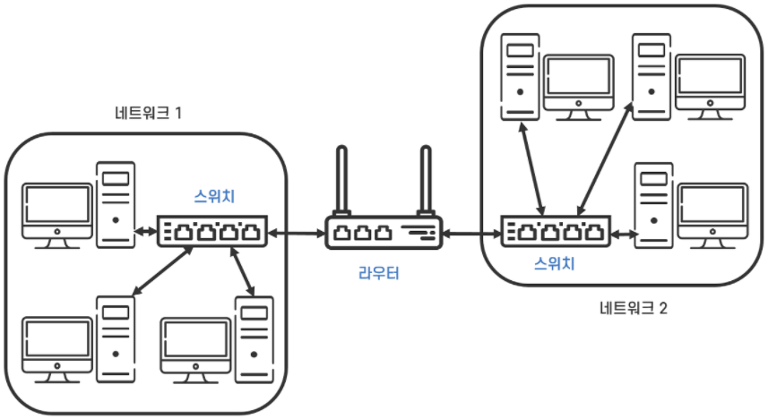
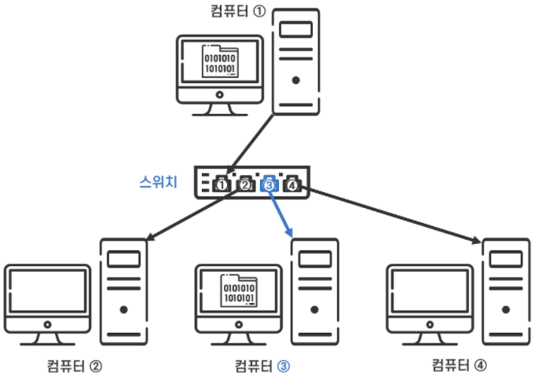
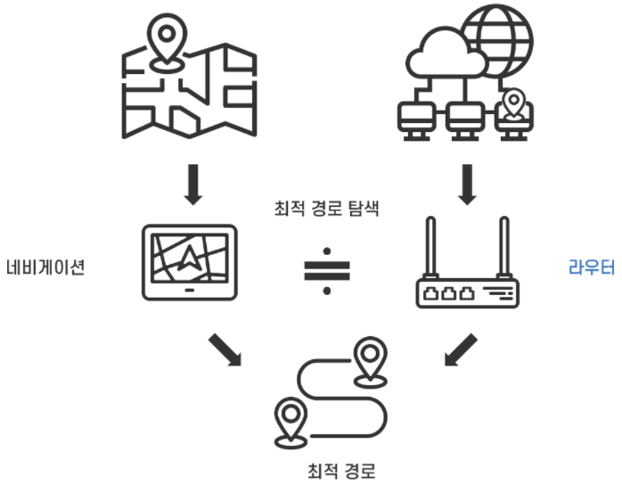
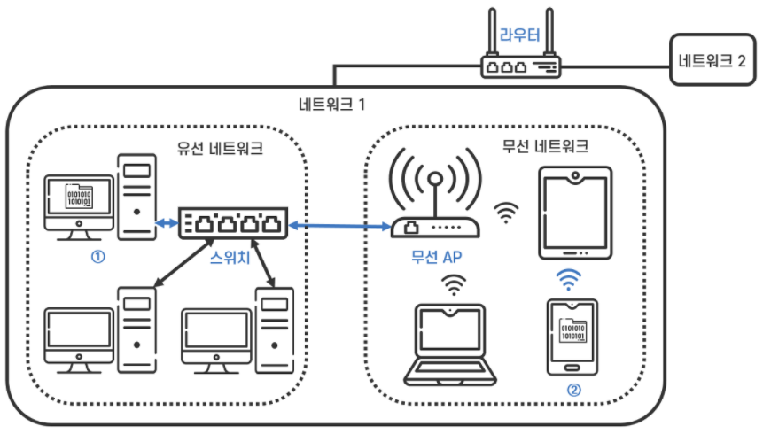
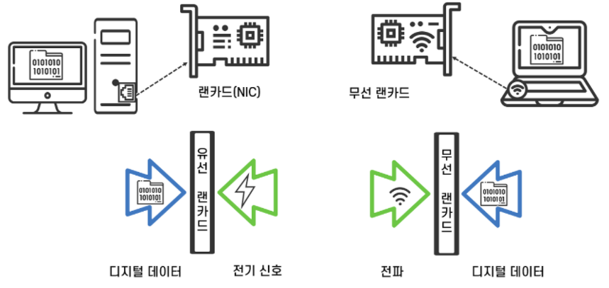

## 컴퓨터 통신과 네트워크

### 컴퓨터 통신, 네트워크

- 네트워크 : 컴퓨터와 컴퓨터를 연결하여 데이터를 주고받을 수 있게 하는 시스템
- 데이터통신, 컴퓨터통신 : 네트워크 상에서 컴퓨터 간 데이터를 송수신하는 것을 일컫는다.

### 구성요소

1. 컴퓨터 :

   네트워크는 통신 환경을 제공하며, 통신의 주체는 컴퓨터에 설치된 Application 이다.

   

2. 전송 매체 :

   전송 매체에는 유선, 무선으로 나눌 수 있으며 매체에 따라 유선 네트워크, 무선 네트워크로 구분됨.

   

   - 유선 전송 매체 :

     전기 신호로 데이터를 전송하는 케이블 (Cable) 을 말한다.

     집, 사무실에서 인터넷에 연결할 때 사용하는 랜선 (LAN Cable)이 대표적 유선 전송 매체

     컴퓨터, 네트워크 장비의 랜 포트 (LAN Port) 에 랜선을 꽂아 서로 연결한 것이 유선 네트워크

   

   

   - 포트 (Port) :

     하나의 장비와 다른 장비를 연결하기 위한 통로, 물리적인 장비들을 서로 연결하는 인터페이스. 랜선과 포트를 연결하여 네트워크를 만드는 표준 규격이 이더넷 프로토콜임 (Ethernet Protocol)

     

   - 무선 전송 매체 :

     전선 없이 공간을 이동하는 전파 (Radio Wave) 를 말함. 무선 랜 인터페이스를 갖춘 컴퓨터와 연결됨

   

   

3. 네트워크 장비 :

   데이터가 송신지 컴퓨터에서 수신지 컴퓨터로 정확히 도착할 수 있도록 도와주는 중계 장치

   

   

   

   - 스위치 (Switch) :

     여러 대의 컴퓨터를 연결하여 하나의 네트워크를 만들고, 그 안에서 데이터를 전송하는 장비

     랜포트를 스위치(전환) 하면서 데이터의 이동을 컨트롤하여 스위치에 연결된 컴퓨터 중 정확한 수신지 컴퓨터로 데이터 전송

     

     

     

   - 라우터 (Router) :

     네트워크와 네트워크를 연결하여 서로 다른 네트워크 간 데이터를 전송하는 역할을 하는 장비

     데이터 송신지에서 수신지까지 가는 루트 중 최적의 루트를 선택하는 경로 탐색기

     

     

4. 무선 AP, 공유기, 랜카드

   - 무선 AP (Wireless Access Point, 무선 액세스 포인트) :

     유선 네트워크에 랜 케이블 없이 무선으로 접속이 가능하게 만드는 네트워크 장비로 유무선 컴퓨터 간 데이터 이동 중계 역할을 한다.

     유선 네트워크를 구성하는 장비인 스위치나 라우터와 랜 케이블로 연결하고, 무선 AP의 일정 거리 안에 있는 컴퓨터는 무선으로 유선 네트워크에 접속 가능하다.

     무선 AP가 전기신호를 전파로, 전파를 전기신호로 변환하는 기능을 갖고 있어 전기신호를 전달하는 유선 네트워크와 전파를 전달하는 무선 네트워크 간 데이터 전송이 가능해진다.

     대표적인 기술로 WiFi (Wireless Fidelity) 가 있다.

     

   

   

   - 공유기 :

     스위치, 라우터, 무선 AP의 기능을 1대의 기기에 내장하여 간편하게 집, 사무실에서 소규모 네트워크를 구축하는데 사용하는 장비

     인터넷 공유기 (가정용 라우터 Home Router, 브로드밴드 라우터 Broadband Router) 라고 함

     

   

   

   - 전체 구성도 :

     

   

   

   - 랜카드 :

     0과 1로 이루어진 컴퓨터의 디지털 데이터를 전기신호로 변환하고 전기신호를 다시 디지털 데이터로 변환한다.

     무선 랜카드는 디지털 데이터를 전파로, 전파를 디지털 데이터로 변환한다.

     랜카드의 다른 이름은 Network Interface Card. 랜카드를 컴퓨터에 장착하면 랜 포트라는 외부 인터페이스가 생긴다.

     

     

     

     

     

### 출처

>https://better-together.tistory.com/39

