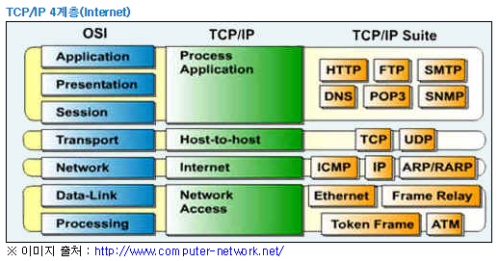

## HTTP

### 인터넷과 Web의 이해

#### 인터넷

- TCP/IP 통신 프로토콜을 이용해 정보를 주고받는 컴퓨터 네트워크를 일컬음
- 네트워크의 네트워크, 모든 컴퓨터를 하나의 통신망 안에 연결 (International Network) 하고자 하는 의도에서 이를 줄여 Internet이라고 명명하는데 어원을 두고 있음.
- 복수의 통신망을 집합시킨 광역 통신망을 뜻하는 일반 명사를 Inter-network 라고 하는데, 미국 알파넷이 이러한 Inter-network 를 본격적으로 구축한 최초의 사례.
- 군용 및 연구 목적으로 사용되던 알파넷에 대한 수요가 많아지며 통신 규약 표준 제정에 필요성이 부각되었고, 군용 MILNET (Military Network) 과 민간용 ARPAnet 을 분리시켰음. 또한 초기 사용하던 NCP (Network Control Program) 보다 속도, 안정성이 향상된 TCP/IP 를 공식 프로토콜로 도입

#### Web (WWW, World Wide Web)

- 인터넷에 연결된 컴퓨터를 통해 사람들이 정보를 공유할 수 있는 전 세계적인 정보 공간을 말하며 간단히 Web 이라고 함

- 인터넷과 동의어로 쓰이는 경우가 많으나 엄격히는 서로 다른 개념임.

  전자메일과 같이 인터넷 상에서 동작하는 하나의 서비스일 뿐임

- 인터넷에서 HTTP 프로토콜 (HiperText Transfort Protocol) 을 사용하여 그림, 문자를 교환하는 전송방식을 말하기도 한다.

  HTML 문서를 주로 주고받는다. (HiperText Markup Language)

  (HTML 문서 : 꺽쇠로 둘러싸인 Tag를 사용하여 구조적으로 이미지, 객체를 내장한 대화형 문서)

- Web의 동작 원리
  1. 사용자가 웹 브라우저 검색창에 특정 사이트 주소 입력
  2. 웹 브라우저가 DNS에게 (도메인)주소 요청
  3. DNS가 웹 브라우저에 사이트의 IP주소 응답
  4. 웹 브라우저가 웹 서버에 IP 주소 이용하여 HTML 문서 요청
  5. 웹 서버는 웹 애플리케이션 서버로 데이터 요청, 웹 애플리케이션 서버에서 데이터베이스에 액세스하여 데이터를 가져와 작업 처리
  6. 웹 애플리케이션 서버에서 작업 처리 결과를 웹 서버로 응답 (결과 전송)
  7. 웹 서버는 웹 브라우저에게 HTML 문서 결과를 응답
  8. 웹 브라우저는 화면에 웹 페이지를 출력 (Rendering, 만들기, 제공, 구현, 연출의 뜻이 있음)

#### 포트 주소 (Port)

- 네트워크 서비스나 특정 프로세스를 식별하는 논리 단위

- 하드웨어 서버(물리적인 컴퓨터)를 찾기 위해 반드시 필요함

- 여러 개의 소프트웨어 프로그램이 각각의 Socket을 사용하여 데이터 통신을 하고 있으므로 Port 번호를 통해 각 Socket을 구분함

- 번호로 구별되며 이를 포트 번호라고 함. IP 주소와 함께 쓰여 해당하는 프로토콜에 의해 사용됨

  (ex) ftp://000.000.000.000:21 URL에서 마지막 21이 포트 번호

- 인터넷 기반 서비스 포트 번호

  |  이름  |       프로토콜        |      포트      |        기능        |
  | :----: | :-------------------: | :------------: | :----------------: |
  |  WWW   |         HTTP          |       80       |     웹 서비스      |
  | Email  |  SMTP / POP3 / IMAP   | 25 / 110 / 114 |   이메일 서비스    |
  |  FTP   |          FTP          |       21       |  파일 전송 서비스  |
  |  DNS   |        TCP/UDP        |       53       | 도메인 네임 서비스 |
  |  NEWS  |         NNTP          |      119       | 인터넷 뉴스 서비스 |
  | TELNET |        TELNET         |       23       |  원격 통신 서비스  |
  | HTTPS  | TLS / SSL 방식의 HTTP |      443       | 암호화된 웹 서비스 |

  


### TCP/IP Protocol 4계층, OSI 7계층



- 4계층 (Application Layer) :
  - OSI 7 계층에서 Session, Presentation, Application 계층에 해당하며 TCP/IP 기반 응용 프로그램을 구분한다.
  - 응용 프로그램들이 네트워크 서비스, 메일 서비스, 웹 서비스를 이용할 수 있도록 표준 인터페이스를 제공
  - HTTP, FTP, Telnet, DNS, SMTP 등의 프로토콜 이용
- 3계층 (Transport Layer) :
  - OSI 7 계층에서 Transport 계층에 해당하며 통신 노드 간 연결을 제어하고 자료의 송수신을 담당한다.
  - 네트워크 양단 송수신 호스트 사이 신뢰성 있는 전송기능 제공
  - 시스템의 논리주소와 포트를 갖고 있어 상위 계층의 프로세스를 연결하여 통신함
  - 정확한 패킷의 전송을 보장하는 TCP, 정확한 전송을 보장하지 않는 UDP 프로토콜을 이용
  - 데이터 정확한 전송보다 빠른 속도의 전송이 필요한 멀티미디어 통신에서 UDP를 사용하면 TCP보다 유용
- 2계층 (Internet Layer) :
  - OSI 7 계층에서 Network 계층에 해당하며 통신 노드 간 IP 패킷을 전송하는 기능 및 라우팅 기능을 담당한다.
  - Transport 계층으로부터 받은 데이터에 IP 패킷 헤더를 붙여 IP 패킷을 만들고, 이를 전송한다.
  - IP, ARP, RARP, ICMP, OSPF 프로토콜 이용
- 1계층 (Network Access Layer) :
  - OSI 7 계층에서 Phisical, DataLink 계층에 해당하며 CSMA/CD, MAC, LAN, X25, 패킷망, 위성 통신, 다이얼 모뎀 등 실제 물리적인 데이터 전송을 담당한다.
  - Network Card, Device Driver 등과 같은 하드웨어적 요소와 관련되는 모든 것을 지원하는 계층
  - 송신 측 : 상위 계층으로부터 전달받은 패킷에 물리 주소 (MAC 주소) 정보를 갖고 있는 헤더를 추가하여 프레임을 만들고, 프레임을 하위 계층인 물리 계층으로 전달
  - 수신 측 : 데이터 링크 계층에서 추가된 헤더를 제거하여 상위 계층인 네트워크 계층으로 전달함


### URI, URL

#### URL (Uniform Resource Locator)

- 역할 : 웹 상에서 문서, 이미지, 동영상 등 자원의 위치를 나타내는 주소. 쉽게 말해 웹 페이지를 찾기 위한 주소.

- 구성

  - 프로토콜 종류 (gopher, telnet, ftp, http, usenet 등)
  - 자원이 있는 서버의 IP 주소, 도메인 주소, 포트 주소
  - 자원의 위치

- 형식

  - 프로토콜 :// IP 주소 or 도메인 주소 or 포트 주소 / 자원 위치

    ```
    scheme://<user>:<password>@<host>:<port>/<url-path>
    http://<host>:<port>/<path>?<searchpart>
    ```


#### URI (Uniform Resource Identifier)

- 웹 에서 사용하는 논리적 또는 물리적 리소스를 식별하는 고유한 문자열 시퀀스

- URI는 식별하고 URL은 위치를 가르킴

- 구성

  URL + 쿼리 스트링 등의 식별자

  path까지를 URL이라고 하고 식별자가 더해져 자원을 표시하게 되면 URI 이다.

  https://example.com/123 --> .com/까지가 URL, 123이 식별자

  https://example.com/one?id=123 --> /one 까지가 URL, ?id=123이 식별자

- 형식

  - 프로토콜 :// IP 주소 or 도메인 주소 or 포트 주소 / 자원 위치 ? 쿼리 스트링

    ```
    scheme://<user>:<password>@<host>:<port>/<path>?<query>#<fragment>
    ```

    

### HTTP (HyperText Transfer Protocol)

- 서버와 클라이언트가 인터넷 상에서 데이터를 주고받기 위한 프로토콜

- 어떤 종류의 데이터도 전송할 수 있도록 설계되었음

- HTTPS : HTTP에서 보안이 강화된 버전으로, 소켓 통신에서 일반 텍스트를 사용하기보다 SSL, TLS 프로토콜을 통해 세션 데이터를 암호화하여 사용한다. 따라서 데이터의 적절한 보호를 보장한다. 기본 TCP/IP 포트는 443 이다.

- 특징

  - 서버/클라이언트 모델을 따름

    

    - 클라이언트가 원하는 서버에 접속
    - 클라이언트가 서버에 요청 (request)
    - 요청에 따른 결과를 서버로부터 받음 (응답, response)
    - 클라이언트와 서버의 연결이 끊김

  - 비연결 지향 (Connectionless) :

    클라이언트가 request를 서버에 보내고 서버가 클라이언트 요청에 맞는 response를 보내면 바로 연결을 끊음

  - 무상태 (Stateless) :

    연결을 끊는 순간 클라이언트와 서버의 통신은 끝나며 상태 정보를 유지하지 않음. 서버가 여러 클라이언트들을 구별할 수 없다는 것.

  - 장점

    - 불특정 다수를 대상으로 하는 서비스에 적합
    - 클라이언트 - 서버가 계속 연결된 형태가 아니므로 클라이언트 서버 간 최대 연결 수 보다 많은 요청과 응답을 처리할 수 있음

  - 단점

    - 응답 후 연결을 끊어버리므로 클라이언트 이전 상황을 알 수 없음 (무상태)

      클라이언트의 정보를 유지하기 위해 Cookie와 같은 기술이 등장

      

  

- HTTP 요청 메세지 형식 (Request Header + 빈 줄 + Request Body)

  - Header

    - 첫 번째 줄 (start-line)

      - 요청 메소드 + 요청 URI + HTTP 프로토콜 버전

        GET /background.png HTTP/1.0

        POST / HTTP 1.1

    - 두 번째 줄 ~ (http headers)

      - Header 정보들 ('KEY':'VALUE' 형태)
      - 각 줄은 Line Feed (LF), Carriage Return (CR)로 구분됨

  - Empty Line

    - 요청에 대한 모든 메타 정보가 전송되었음을 알림

  - Body

    - POST, PUT의 경우에만 존재
    - 요청과 관련된 내용 (HTML 폼 콘텐츠 등)

  

- HTTP 응답 메세지 형식 (Response Header + 빈 줄 + Response Body)

  - Header

    - 첫 번째 줄 (status-line)

      - HTTP 프로토콜 버전 + 응답 코드 + 응답 메세지

        HTTP/1.1 404 Not Found.

    - 두 번째 줄 ~ (http headers)
      - Header 정보들 ('KEY':'VALUE' 형태)
      - 각 줄은 Line Feed (LF), Carriage Return (CR)로 구분됨

  - Empty Line

    - 요청에 대한 모든 메타 정보가 전송되었음을 알림

  - Body

    - 실제 응답 리소스 데이터
    - 201, 204와 같은 상태 코드를 가진 응답에는 보통 body가 존재하지 않음

  

- HTTP 기본 속성

  - 요청 메소드

    - 요청의 종류를 알리기 위해 사용

      GET : 정보 요청 (SELECT)

      POST : 정보 밀어넣기 (INSERT)

      PUT : 정보 업데이트 (UPDATE)

      DELETE : 정보 삭제 DELETE

      HEAD : (HTTP) 헤더 정보만 요청하는 메소드. 해당 자원이 존재하는지 혹은 서버에 문제가 없는지 확인.

      OPTIONS : 웹 서버가 지원하는 메소드의 종류를 요청

      TRACE : 클라이언트의 요청을 그대로 반환하는 메소드. 일종의 echo 기능으로 서버 상태를 확인하기 위한 목적으로 사용됨

  - 요청 URI

    - 요청하는 자원 (혹은 그 위치) 를 명시

  - HTTP 프로토콜 버전

    - 웹 브라우저가 사용하는 프로토콜 버전

  - 응답 상태 코드

    - 요청의 성공 여부 (200, 404, 302 등)

  - 응답 메세지

    - 상태 코드에 대한 이해를 돕기 위해 짧고 간결한 설명을 글로 나타냄


### 출처

>위키백과 Internet, HTTP, HTML
>
>https://ryusae.tistory.com/4
>
>https://smartshk.tistory.com/2
>
>https://all-young.tistory.com/21
>
>https://all-young.tistory.com/20?category=915653
>
>https://programming119.tistory.com/194
>
>https://medium.com/@js230023/url-%EA%B3%BC-uri%EC%9D%98-%EC%B0%A8%EC%9D%B4-154d70814d2a
>
>https://gmlwjd9405.github.io/2019/04/17/what-is-http-protocol.html