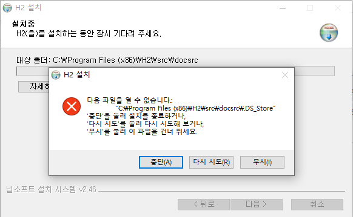
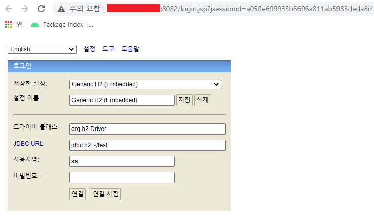
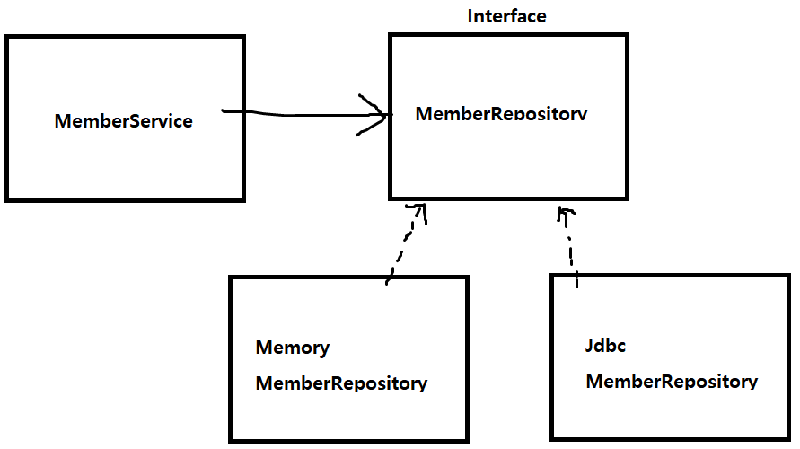
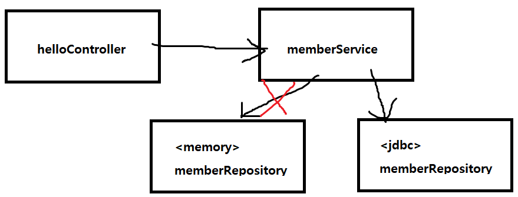

## 스프링 DB 접근 기술


### H2 데이터베이스 설치

- https://h2database.com/html/main.html

- 윈도우에서 설치하는데 에러 발생 ..

  

  

- git bash를 열어서 h2/bin 의 ./h2.sh, ./h2.sh* 명령어 실행했으나 실패

- 이 전에 파일에 권한은 줘야한다. 유저/그룹/기타사용자 111 101 101 RWX (읽기 쓰기 실행)

  ```bash
  kkkstudy@LAPTOP-66BEVBB1 MINGW64 ~/Downloads/h2/bin
  $ chmod 755 h2.sh
  
  kkkstudy@LAPTOP-66BEVBB1 MINGW64 ~/Downloads/h2/bin
  $ ./h2.sh
  Error: Could not find or load main class org.h2.tools.Console
  Caused by: java.lang.ClassNotFoundException: org.h2.tools.Console
  
  kkkstudy@LAPTOP-66BEVBB1 MINGW64 ~/Downloads/h2/bin
  $ ./h2.sh*
  Error: Could not find or load main class org.h2.tools.Console
  Caused by: java.lang.ClassNotFoundException: org.h2.tools.Console
  ```

  

- 구글링 해보니 h2/bin 의 ./h2.bat, ./h2w.bat 으로 실행하길래 해봤더니 정상 동작

  

  

- 윈도우의 경우 탐색기 유저 폴더에 test.mv.db 파일이 생성된다.

  

  

- 접속 URL은 소켓으로 연결 jdbc:h2:tcp://localhost/~/test

  ```sql
  drop table if exists member CASCADE;
  create table member
  (
  id bigint generated by default as identity,
  name varchar(255),
  primary key (id)
  );
  ```


### 순수 JDBC

#### 환경설정

- Java는 기본적으로 DB와 붙이려면 JDBC가 꼭 필요함
- Database client인 h2 client도 필요
- build.gradle 설정

  ```java
  implementation 'org.springframework.boot:spring-boot-starter-jdbc'
  runtimeOnly 'com.h2database:h2'

- src/main/resources/application.properties 설정

  ```java
  spring.datasource.url=jdbc:h2:tcp://localhost/~/test
  spring.datasource.driver-class-name=org.h2.Driver
  spring.datasource.username=sa
  ```

  spring.datasource.username=sa 추가하지 않으면 Wrong user name or pasword 오류가 발생한다...


#### 스프링 설정

- 기존 코드는 건드리지 않고 애플리케이션 설정 코드(assembly code)만 수정하면서 작업할 수 있다는 것이 스프링의 가장 큰 장점이다.

- SpringConfig.java

  ```java
  @Configuration
  public class SpringConfig {
  
      // 리포지토리 Bean을 Jdbc로 바꿔주면서 생성자에 필요한 변수 설정 및 @Autowired설정
      private final DataSource dataSource;
      @Autowired
      public SpringConfig(DataSource dataSource) {
          this.dataSource = dataSource;
      }
  
      @Bean
      public MemberService memberService() {
          return new MemberService(memberRepository());
      }
  
      @Bean
      public MemberRepository memberRepository() {
  //        return new MemoryMemberRepository();
  // 여기를 Jdbc로 바꿔주었다.
          return new JdbcMemberRepository(dataSource);
      }
  }
  ```

- 개방-폐쇄 원칙 (OCP Open-Closed Princple)

  확장에는 열려있고 수정, 변경에는 닫혀있다.

- 스프링의 DI를 사용하여 기존 코드를 수정, 변경하지 않고 설정만으로 구현 클래스를 변경할 수 있다.

- 클래스 관계

  


- 스프링 컨테이너

  


### 통합 테스트

- Spring과 함께 테스트를 진행하기 위해 @SpringBootTest annotation을 사용한다. (DB도 포함)

- Transaction을 commit하지 않고 테스트 후 이전 상태로 되돌리기 위해(rollback) @Transactional annotation을 사용한다.

  테스트 시작 전에 트랜잭션을 시작하고 테스트 완료 후 항상 롤백하여 다음 테스트에 영향을 주지 않도록 하기 위함

- java만 실행하는 테스트를 단위테스트라고 한다.


### 스프링 Jdbc-Template

- 스프링 JdbcTemplate과 MyBatis같은 라이브러리는 JDBC API에서 본 반복 코드를 대부분 제거해준다.

  SQL은 직접 작성해야한다.

- 디자인 패턴 중 template method pattern을 사용하여 코드를 줄임..


### JPA

- SQL 쿼리를 JPA에서 자동으로 처리해줌으로써 개발 생산성을 크게 높여준다.
- JPA를 사용하면 SQL과 데이터 중심의 설계에서 객체 중심의 설계로 패러다임 전환 가능

- build.gradle 설정

  ```java
  implementation 'org.springframework.boot:spring-boot-starter-data-jpa'
  runtimeOnly 'com.h2database:h2' // 같이 하는게 맞나?!
  ```

- src/main/resources/application.properties 설정

  ```java
  spring.jpa.show-sql=true // jpa가 날리는 sql을 볼 수 있다.
  spring.jpa.hibernate.ddl-auto=none // 객체를 보고 테이블을 만들어주는 기능은 일단 다 만들어져 있으므로 끈다. none or create
  ```

- JPA는 인터페이스 제공을 하고 구현체로 하이버네이트, 이클립스 등 여러개 벤더를 사용한다.

- ORM(Object Relational Mapping) 객체 관계(DB, 테이블) 매핑

- JPA를 사용하려면 엔티티 매핑을 해야한다.

  ```java
  @Entity
  
  @Id @GeneratedValue(strategy = GenerationType.IDENTITY)
  //(DB가 자동 생성해주는 identity 전략)
  ```

- business로직에 @Transactional 표기 해준다.


### 스프링 데이터 JPA

- 스프링부트, JPA만 사용해도 개발 생산성이 증가하여 개발할 코드가 줄어든다.

- 스프링 데이터 JPA까지 사용하면 기존의 한계를 넘어 리포지토리에 구현 클래스 없이 인터페이스만으로 개발을 완료할 수 있다.

  반복 개발해온 CRUD 기능도 스프링 데이터 JPA가 모두 제공한다.

- JPA를 편리하게 하는 기능이므로 JPA를 먼저 학습한 후에 스프링 데이터 JPA를 학습하도록 한다.

- build.gradle, application.properties -> JPA설정을 그대로 사용한다.

- 순서

  스프링 데이터 JPA가 Interface를 보고 스프링 빈을 자동으로 만들어서 등록

  Interface에서 상속받은 (extends JpaRepository<Member, Long>, MemberRepository)

- 상속순서

  JpaRepository -> PagingAndSortingRepository -> CrudRepository -> Repository

  JpaRepository를 상속하면 공통 메소드들을 다 사용할 수 있음.

  findAll, save, delete, findOne, 등등등

- 비즈니스 로직에서 Override가 필요한 다른 메소드들마저도 메소드 이름에 따라 JPQL 쿼리문을 만들어주는 규칙이 있다.

  ```java
  //JPQL : select m from Member m where m.name = ?
  @Override
  Optional<Member> findByName(String name);
  ```

- 실무에서는 JPA와 스프링 데이터 JPA를 기본으로 사용하고, 복잡한 동적 쿼리는 Querydsl이라는 라이브러리를 사용한다.

  Querydsl 라이브러리로 쿼리를 자바 코드로 안전하게 작성할 수 있으며 동적 쿼리 또한 편리하게 작성 가능하다.

  이 조합으로도 어려운 쿼리는 JPA가 제공하는 네이티브 쿼리, JdbcTemplate을 사용하면 된다.


### 종합

- 순수Jdbc 

- 스프링 JdbcTemplate : 반복되는 코드가 줄어드나 SQL은 직접 작성

- JPA : 기본적인 CRUD 쿼리 작성할 필요가 없다. 복잡한 쿼리는 Jpql작성 필요.

- 스프링 데이터 JPA : 구현 클래스 작성할 필요가 없이 인터페이스만으로 개발 완료

  


### 기타

- 생성자가 한 개 이면 DI @Autowired 생략 가능

- 윈도우에서 H2 DB 프로세스 죽이기

  1. cmd창 관리자 권한으로 오픈

  2. netstat -ano | findstr 8082

  3. tasklist | findstr 28800

  4. taskkill /f /pid 28800

  ```bash
  C:\WINDOWS\system32>netstat -ano | findstr 8082
    TCP    0.0.0.0:8082           0.0.0.0:0              LISTENING       28800
    TCP    192.168.192.209:3718   192.168.192.209:8082   TIME_WAIT       0
    TCP    192.168.192.209:8082   192.168.192.209:11364  ESTABLISHED     28800
    TCP    192.168.192.209:11364  192.168.192.209:8082   ESTABLISHED     29056
    TCP    [::]:8082              [::]:0                 LISTENING       28800
  
  C:\WINDOWS\system32>tasklist | findstr 28800
  javaw.exe                    28800 Console                   27     93,072 K
  
  C:\WINDOWS\system32>taskkill /f /pid 28800
  성공: 프로세스(PID 28800)가 종료되었습니다.
  ```

- 단축키

  ctrl + alt + n : 인라인으로 바꿔준다.

  ctrl + alt + v : 표현형식을 바꿔준다. (간편 -> 타입 변수명 = 메소드 ~~맞나?~~)

  ctrl + e : 최근에 열어본 파일을 찾을 수 있다.

  ctrl + alt + 방향키 : 최근 열어본 파일 내부 위치?까지의 순서로 이동 하는듯..

- Interface가 Interface를 상속하는 경우 implements가 아닌 extends를 사용한다.
