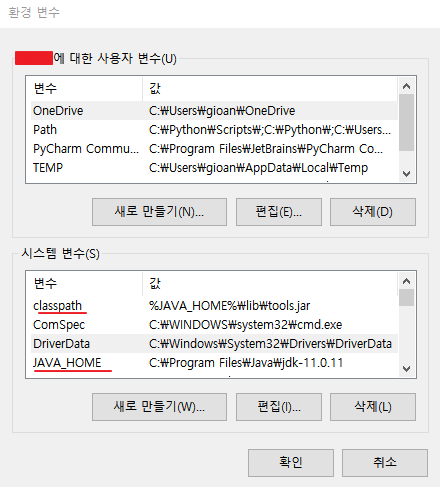
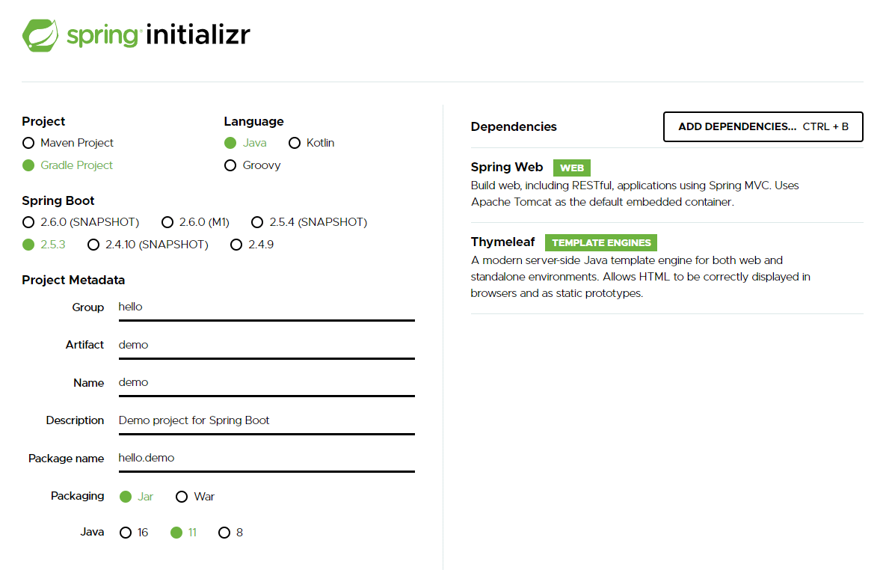
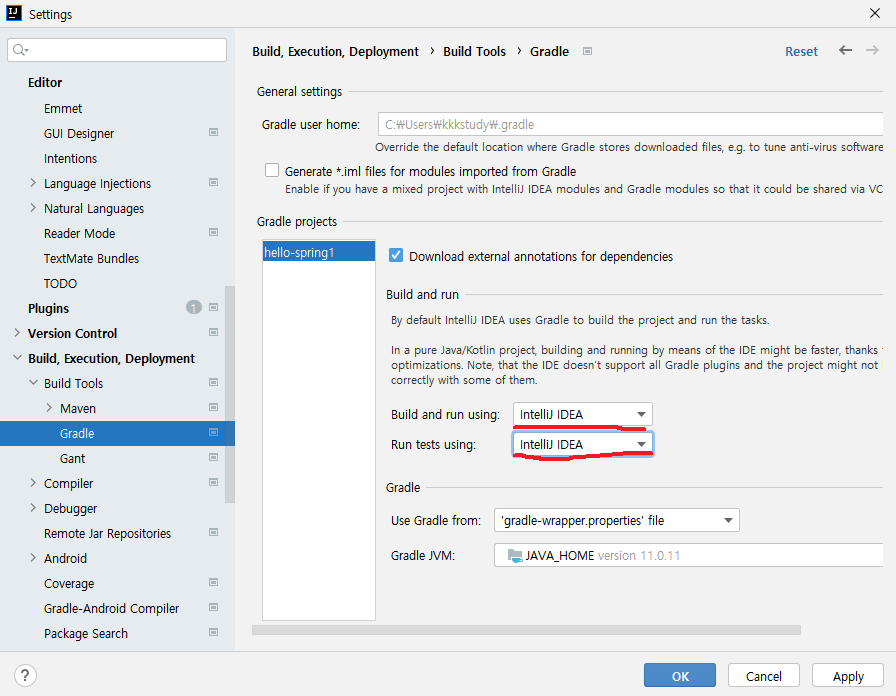
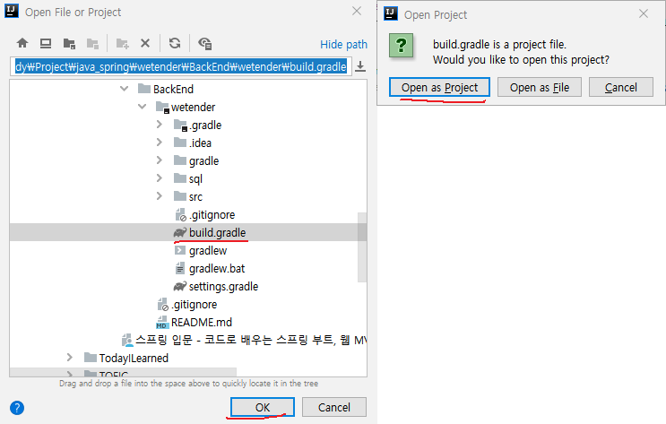
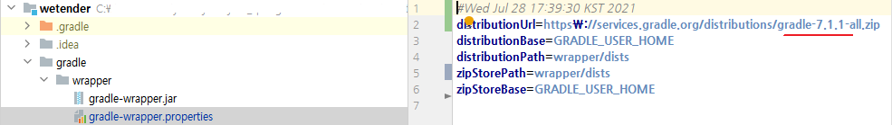
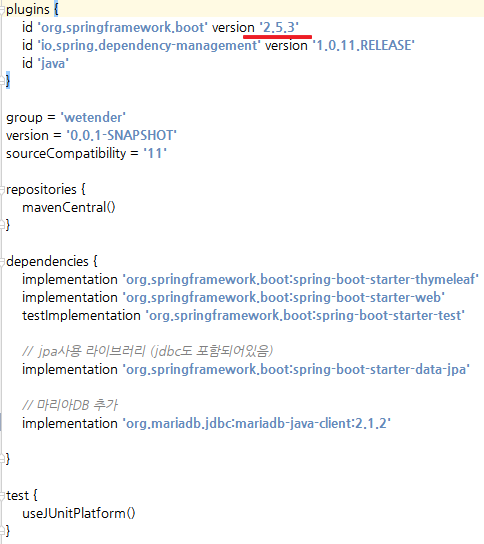
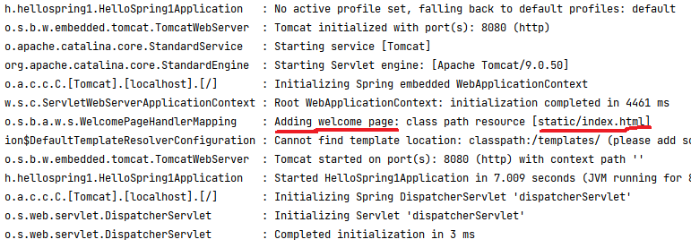
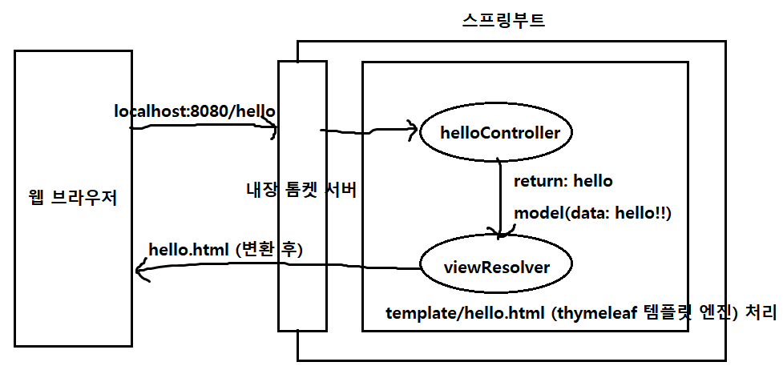

>  자바 스프링 입문 차 인프런 김영한님의 **무료 강의**를 보며 정리한 내용입니다.


## Java Spring 환경설정


### JDK, IDE 설치 및 Java환경변수 설정

#### JDK, IntelliJ 설치

- Java 11 설치
- IntelliJ 설치


#### Java 환경변수 설정

- classpath 추가

  %JAVA_HOME%\lib\tools.jar

- JAVA_HOME 추가

  C:\Program Files\jdk-11.0.11

- Path에 classpath, JAVA_HOME 추가

  %JAVA_HOME%\bin;%classpath%;




### Spring Boot 생성 및 IntelliJ 실행

#### spring boot 생성

- https://start.spring.io/

- Gradle, Java 선택

- Spring Boot

  SNAP SHOT -> 만들고 있는 버전

  M1 -> 정식 릴리즈는 아님

  2.5.3 뒤에 아무것도 없는 것이 정식버전

- 그룹 : 기업명 등등

- 아티팩트 : 프로젝트명

- Dependencies : spring web, **thymeleaf(HTML을 만드는 템플릿 엔진)** 선택

- 다운로드하여 압축 해제




#### IntelliJ 실행

- build.gradle 파일의 상위 폴더를 눌러서 프로젝트를 실행하거나
- build.gradle 파일을 프로젝트로 열거나 (open as a project)


- 아래 설정을 하면 gradle을 통하지 않고 IntelliJ에서 바로 java를 바로 실행하므로 실행속도가 빨라질 수 있음




#### IntelliJ Build가 안될 때

1. build.gradle파일을 직접 프로젝트로 열어준다. (open as a project)
2. .gradle, .idea 삭제 후 Intellij 재실행하여 1을 반복한다. (dependency 새로 import 하기)




3. 제일 강력한 방법으로는 Intellij 삭제하고 최신 버전으로 새로 깔았더니 잘 된다..

spring boot 2.5.3하고 gradle 7.1.1버전이 호환이 잘 안되는 듯 하다.

gradle 6.8.3으로 바꾸면 빌드가 잘 되는데, 팀원들과 동일한 버전으로 작업을 위해 인텔리제이를 새로 설치했고

참고로 java 1.8, java 14도 환경변수에서 지워버렸다.






### 파일트리

- gradle

  그래들 사용을 위한 폴더

- main

  하위에 

  java 하위에 패키지와 소스파일

  resources 하위에 xml, html 및 설정파일

- test

  test 하위에 테스트 코드를 분리해 놓았음

- build.gradle

  의존관계 및 버전 설정 등이 정의되어 있다.

  ```java
  repositories {
  	mavenCentral()
  } // mavenCentral 이라는 사이트, 의존성 파일들을 다운받는 경로
  
  dependencies {
  	implementation 'org.springframework.boot:spring-boot-starter-thymeleaf'
  	implementation 'org.springframework.boot:spring-boot-starter-web'
  	testImplementation 'org.springframework.boot:spring-boot-starter-test'
  } // spring boot 파일을 내려받을 때 선택한 dependencies, 개발 과정에서 여러가지를 더 추가할 수 있다
  ```


### 초기 어플리케이션 실행

- 환경설정 완료
- tomcat이란 웹서버를 내장하고 있고, 여기서 스프링을 실행함
- 보여줄 페이지가 없기 때문에 404 에러가 나온 것임


### 라이브러리

#### 스프링 부트 라이브러리

하위 라이브러리를 자동으로 다운로드 받게 된다.

- spring-boot-starter-web
  - spring-boot-starter-tomcat: 톰캣(웹서버)
  - spring-webmvc: 스프링 웹 MVC
- spring-boot-starter-thymeleaf: 타임리프 템플릿 엔진(VIew)
- spring-boot-starter(공통)
  - spring-boot
    - spring-core
  - spring-boot-starter-logging
    - logback, slf4j


#### 테스트 라이브러리

- spring-boot-starter-test
  - junit: 테스트 프레임워크
  - mockito: 목 라이브러리
  - assertj: 테스트 코드를 좀 더 편하게 작성할 수 있도록 도와주는  라이브러리
  - spring-test: 스프링 통합 테스트 지원


### View설정 및 실행

#### welcome page

- index라는 이름을 welcome페이지로 사용하므로 resources/static/ 하위에 index.html를 만들어주면 됨
- run log에서 확인 가능




#### thymeleaf 템플릿엔진 동작



- 컨트롤러에서 리턴 값으로 반환한 문자를 뷰리졸버(viewResolver)가 화면을 찾아서 처리
- 'resources:templates/' + (ViewName) + '.html'


#### 서버에서 Build하기 (IDE 사용X)

- 프로젝트 폴더로 이동해서 아래 커맨드 입력
- git bash 열어서 쳐도 됨

```bash
./gradlew build
cd build/libs
java -jar hello-spring-0.0.1-SNAPSHOT.jar
./gradlew clean build // 완전히 지우고 다시 빌드
```


- window cmd 열어서 프로젝트 폴더로 이동해서 아래 커맨드 입력

```bash
gradlew // gradlew.bat 실행 명령어
cd build/libs
java -jar hello-spring-0.0.1-SNAPSHOT.jar
```

