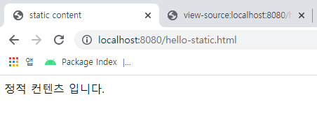
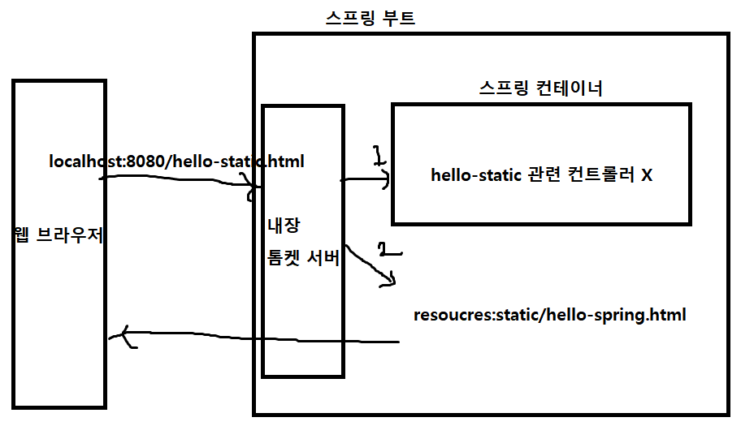
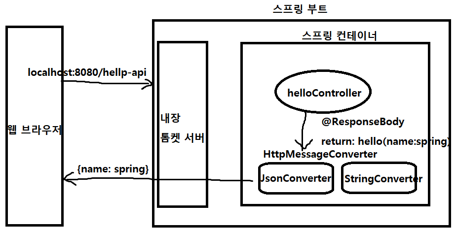

> 자바 스프링 입문 차 인프런 김영한님의 **무료 강의**를 보며 정리한 내용입니다.


## 스프링 웹 개발 기초

### 정적 컨텐츠

- 서버에서 파일을 그대로 웹 브라우저에 내려준다.

- src/main/resources/static/hello-static.html 만든 후 web browser에서 localhost:8080/hello-static.html 접속

  

- 웹브라우저 요청 ---> 스프링부트 내장 톰켓 서버 ---> 스프링 컨테이너 ---> resources 탐색 ---> 클라이언트로 반환




### MVC, 템플릿 엔진

- Model, View, Controller 패턴을 주로 사용

- Model, Controller (비즈니스로직이나 내부 연산 처리에 집중) / View(화면을 그리는데 집중)

  내부 연산의 결과를 Model에 담아 View에 보내주고 View에서 화면을 그림

- HTML을 동적으로 바꿔서 내려준다. (템플릿 엔진)

- thymeleaf의 기능으로 html 파일을 절대경로로 열어볼 수 있다.

```html
<html xmlns:th="http://www.thymeleaf.org">
<body>
<p th:text="'hello ' + ${name}">모델 안 거치고 열면 이게 나옴</p>
<!-- 보통 개발 편의를 위해서 서버 안 거치고 열어봤을 때 알아볼 수 있는 표식 적어둠 -->
</body>
</html>
```

```java
@GetMapping("hello-mvc")
public String helloMvc(@RequestParam("name") String name, Model model) {
    model.addAttribute("name", name);
    return "hello-template";
}
```

​	http://localhost:8080/hello-mvc  : 에러 발생

​	http://localhost:8080/hello-mvc?name=hihihi : get방식으로 name=hihihi를 넘겼으므로 페이지에 hihihi가 출력됨

- 웹브라우저 요청 (localhost:8080/hello-mvc) ---> 내장 톰켓 서버 ---> 스프링 부트

  ---> 스프링 컨테이너

  helloController

  return: hello-template, model(key: value) ---> 스프링 부트

  ---> 스프링 컨테이너

  viewResolver

  templates/hello-template.html (Thymleaf 엔진이 HTML변환) ---> 웹브라우저


### API

- 정적컨텐츠를 제외하면 HTML / 데이터(API) 웹 브라우저로 보내는 두 가지 방식이 있음

- API방식 : XML, JSON 등의 데이터를 클라이언트로 전달하는 방식
- MVC방식 : 템플릿엔진을 통해 화면 렌더링 후 HTML을 내려주는 방식
- 서버끼리 통신할 때 API 방식을 사용

```java
@GetMapping("hello-string")
@ResponseBody
public String helloString(@RequestParam("name") String name) {
    return "hello " + name;
}
```

​	ResponseBody : HTTP의 Head, Body 중 Body에 데이터를 보내겠다는 의미


```java
@GetMapping("hello-api")
@ResponseBody
public Hello helloApi(@RequestParam("name") String name) {
    Hello hello = new Hello();
    hello.setName(name);
    return hello;
}

static class Hello {
    private String name;

    public String getName() {
        return name;
    }

    public void setName(String name) {
        this.name = name;
    }
}
```


- 웹브라우저 요청 ---> 내장 톰켓 서버 ---> 스프링 부트
  
  ---> 스프링 컨테이너
  
  helloController
  
  @ResponseBody return
  
  ---> HttpMessageConverter (ResponseBody annotation이 있으면 Http컨버터 동작)

​      문자 : StringConverter, 객체 : JsonConverter ---> 웹브라우저




- @ResponseBody 사용

  - HTTP의 BODY에 문자 내용을 직접 반환

  - viewResolver 대신 HttpMessageConverter 동작

  - 기본 문자 -> StringHttpMessageConverter

  - 기본 객체 -> MappingJackson2HttpMessageConverter

    (Jackson, gson : 객체->Jason 변환 라이브러리)

  - byte 및 기타 처리는 HttpMessageConverter가 기본
  

