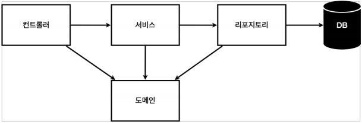
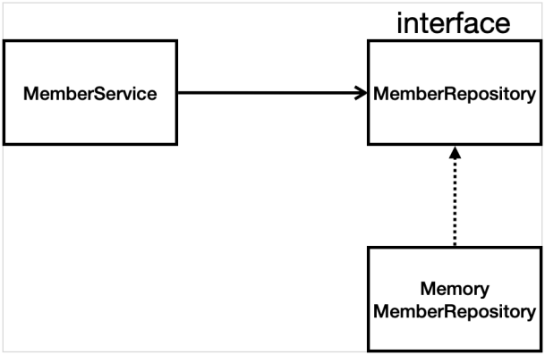

> 자바 스프링 입문 차 인프런 김영한님의 **무료강의**를 보며 정리한 내용입니다.


## 회원관리 예제 - 백엔드 개발


### 비즈니스 요구사항 정리

- 데이터 : 회원ID, 이름

- 기능 : 회원 등록, 조회

- 일반적인 웹 어플리케이션 계층 구조

  

  컨트롤러 : 웹 MVC의 컨트롤러

  서비스 : 핵심 비즈니스 로직

  리포지토리 : 데이터베이스 접근, 도메인 객체를 DB에 저장하고 관리

  도메인 : 비즈니스 도메인 객체, 예) 회원, 주문, 쿠폰 등등 주로 데이터베이스에 저장하고 관리됨

- 클래스 의존관계

  

  인터페이스 구현하여 클래스를 쉽게 변경할 수 있도록 설계

  RDB, NoSQL


### 회원 도메인, 리포지토리

- 도메인 : 비즈니스 객체(멤버) 클래스

- 리포지토리 인터페이스 : 멤버를 DB에 저장하고 관리

  save, findById, findByName, findAll

- 인터페이스 구현 클래스 : Interface를 implements 하여 메소드 오버라이딩

  인터페이스의 메소드 모두 오버라이딩 하여 구현

- java 문법
  - HashMap<> : Map interface를 implements 한 클래스로 중복 허용하지 않으며 key 또는 value 값으로 null을 허용한다.
  
  - HashTable<> : Map interface를 implements 한 클래스로 중복 허용하지 않으며 key 또는 value 값으로 null을 허용하지 않는다.
  
    ```java
    Map<Key, Value> mapVal = new HashMap<>();
    mapVal.values(); // 모든 값 가져오기
    mapVal.values().stream() // 모든 값 가져와서 lambda 형식으로 filter 적용하기
        .filter(value -> value.getName().equals(name)) // 인자로 받은 name과 동일한지 확인
        .findAny(); // 하나라도 있으면 가져옴
    ```
  
  - Optional : Null값을 리턴할 때 Optional 객체로 감싸서 반환
  
  - 동시성 문제 처리를 해야 하는데 단순하게 작성함.. Hash -> ConcurrentHash, Long -> AtomicLong


### 회원 리포지토리 테스트 케이스 작성

- 개발한 기능 테스트 방법

  - java의 main 메소드를 통해서 실행
  - 웹 애플리케이션 컨트롤러를 통해 실행
  - ↑위의 두 가지 방법은 반복 실행이 어렵고 여러 테스트를 한번에 실행하기 어렵다는 단점이 있어 이러한 문제를 해결하기 위한 방안으로 JUnit이라는 프레임워크를 사용하여 테스트 한다.

- src/test/java 하위 폴더에 패키지를 생성하여 테스트 한다.

- 테스트 파일의 모든 메소드는 순서 상관없이 동작하게끔 설계해야한다.

  -> @AfterEach annotation을 사용하여 하나의 메소드가 실행된 후 실행할 메소드를 만들어 repository의 clear 호출,

  -> repository 클래스에는 Map의 메소드인 clear()를 호출하는 함수를 만들어준다.

```java
//import org.junit.jupiter.api.Assertions; // Assertions.assertEquals()
import org.assertj.core.api.Assertions; // Assertions.assertThat(member).isEqualTo(result);
import static org.assertj.core.api.Assertions.*; // assertThat(member).isEqualTo(result);
// alt + Enter를 누르면 static 표현으로 바꿀 수 있음
```


### 회원 서비스

- 회원 리포지토리를 이용하여 비즈니스 로직을 만든다.

- 비즈니스 로직은 좀 더 비즈니스적인 네이밍 규칙을 따르도록 한다.

- java 문법

  null 발생 가능성이 있으면 Optional로 감싸주어 반환한 뒤, Optional의 내장 메소드들을 사용하여 쉽게 null 여부를 확인할 수 있다.

  ```java
  // 그냥 값만 꺼내온다면
  result.get();
  //nullable한 객체 반환 시 존재하는지 확인
  result.ifPresent();
  // 값이 있으면 가져오고 없으면 default지정
  result.orElseGet()
  ```

  ```java
  Optional<Member> result = memberRepository.findByName(member.getName());
  result.ifPresent(m -> {
      throw new IllegalStateException("이미 존재하는 회원입니다.");
  });
  // Optional 객체로 반환 되었으므로 아래처럼 바로 표현 가능
  memberRepository.findByName(member.getName())
      .ifPresent(m -> {
          throw new IllegalStateException("이미 존재하는 회원입니다.");
      });
  // Ctrl + Alt + M 으로 아래와 같은 메소드로 추출할 수 있음
  private void validateDuplicateMember(Member member) {
      memberRepository.findByName(member.getName())
          .ifPresent(m -> {
              throw new IllegalStateException("이미 존재하는 회원입니다.");
          });
  }
  ```

  


### 회원 서비스 테스트 케이스 작성

- ctrl + shift + t 단축키로 자동생성하면 같은 패키지명으로 src/test/java 하위에 만들어진다.
- given, when, then 순으로 짜는게 도움이 됨

```java
// given - 주어진 데이터, 객체를 만들고
Member member = new Member();
member.setName("spring");
// when - 특정 시점에, 테스트할 메소드를 사용하고
Long saveId = memberService.join(member);
// then - 검증 구, 정상 수행되었는지 잘못된 입력에서 에러를 발생하는지 확인한다
Member findMember = memberService.findOne(saveId).get();
assertThat(member.getName()).isEqualTo(findMember.getName());
```


- Dependancy Injection (DI) :

  MemberService 객체를 만들 때 멤버변수인 MemberRepository 객체를

  만들어서 생성자 인자로 전달하는 방식

```java
public class MemberService {

// 1   private final MemberRepository memberRepository = new MemoryMemberRepository();
    private final MemberRepository memberRepository;

    public MemberService(MemberRepository memberRepository) {
        this.memberRepository = memberRepository;
    }
    
class MemberServiceTest {

// 1   MemberService memberService = new MemberService();
// 1   MemoryMemberRepository memberRepository = new MemoryMemberRepository();

    MemberService memberService;
    MemoryMemberRepository memberRepository;

    @BeforeEach
    public void beforeEach() {
        memberRepository = new MemoryMemberRepository();
        memberService = new MemberService(memberRepository);
    }
    
// Test에서 만든 MemoryMemberRepository 객체는 Test에서 만든 MemberService 객체 내부의 MemoryMemberRepository 객체와 달라질 수 밖에 없어서 의존 주입을 하여 사용한다.
// 여기서는 생성자 주입을 사용하였음
```


### 단축키모음

- shift + F6 을 누르면 같은 단어를 동시에 바꿀 수 있음
- ctrl + alt + n : 인라인 표현으로 바꿀 수 있음
- alt + Insert : 게터, 세터 또는 생성자 만드는 탭을 띄워줌
- alt + Enter : static 표현으로 바꿀 수 있음
- ctrl + alt + v : 메소드 사용 형식을 자동으로 바꿔줌
- ctrl + alt + m : 메소드로 Extract, Test 클래스 만들 때
- shift + F10 : 직전에 런 한 것을 다시 런
- ctrl + shift + t : 클래스의 테스트 파일을 같은 이름으로 src/test/java 하위에 만들 수 있음


### 기타

- 패키지를 import하려면

  import org.assertj.core.api.Assertions.*;

- 패키지 내 메소드 명으로 바로 사용하려면

  import static org.assertj.core.api.Assertions.*;

  **static** 을 붙여준다.

