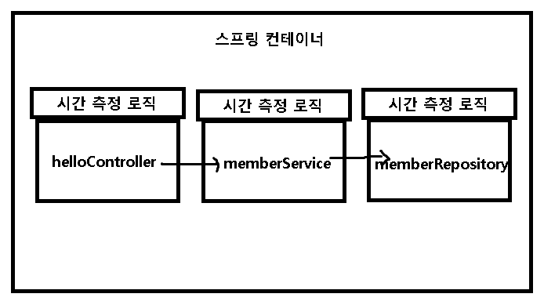
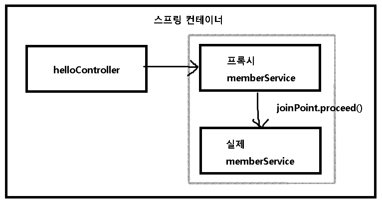
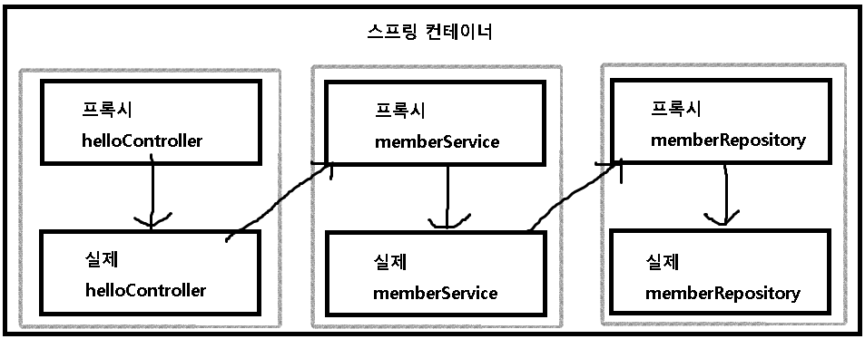

## AOP

>  자바 스프링 입문 차 인프런 김영한님의 **무료강의**를 보며 정리한 내용입니다.

### AOP가 필요한 상황

- 메소드의 호출 시간을 측정하고자 할 때

- 공통 관심 사항 (cross-cutting concern)
- 핵심 관심 사항 (core concern)

### 문제점

- 회원가입, 회원 조회에 시간을 측정하는 기능은 핵심 관심사항이 아니다.
- 시간을 측정하는 로직은 공통 관심사항이다.
- 시간을 측정하는 로직과 핵심 비즈니스 로직이 섞여서 유지보수가 어렵다.
- 시간을 측정하는 로직을 별도의 공통 로직으로 만들기 어렵다.
- 시간을 측정하는 로직을 변경할 때 모든 로직을 찾아가면서 변경해야 한다.

### AOP 적용

- AOP : Aspect Oriented Programming

- aop 패키지에 클래스 만들어서 @Aspect 사용

- 함수에는 @Around("execution(* hello.hellospring..*(..))") 사용하여 패키지 하위에 다 적용할 것을 명시

- 시간을 측정하는 로직을 별도로 만들어 핵심 관심사항을 깔끔하게 유지한다.

- 원하는 적용 대상을 선택할 수 있다.

- 의존관계

  

  

  

### 기타

- 단축키
  - ctrl + alt + v : 리턴타입에 맞게 변수를 만들어줌
  
    ctrl + alt + n : 인라인 표현법으로 바꿔줌

