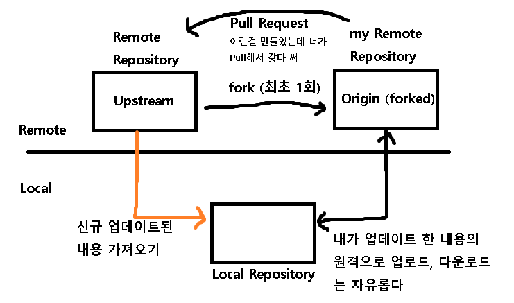

## 강제 pull

- git fetch --all

- git reset --hard origin/master

  대략 --all 옵션으로 모든 변경사항을 fetch한 뒤, 원격의 master(origin/master)로 HEAD를 이동시키기 때문에 강제 pull이 되는 것으로 생각된다.

---

사실 위 두 개 명령어만으로도  강제 pull이 되지만... 한 번 더

- git pull origin master

## pull

- git pull origin master

  origin으로 등록되어있는 원격저장소에서 master로 변경사항을 내려받는다.

## fetch, merge

- 원격저장소 upstream에서 변경사항 내려받기 : git fetch upstream

  대체로 upstream은 본인 계정의 원격저장소가 아니라 통상 fork한 원격저장소 명칭으로 사용한다.

  대략 아래 그림과 같은 구조

  

- fetch한 내용 별로 branch가 생성되어 Histroy를 각각 가지게 되는데,

  이를 내 맘대로 master에 merge해도 되고 다른 branch에 merge해도 된다.

  자세한 내용은 실습 후 추가하도록 하겠다.

